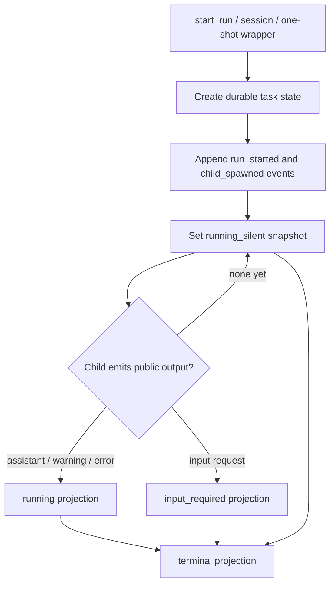
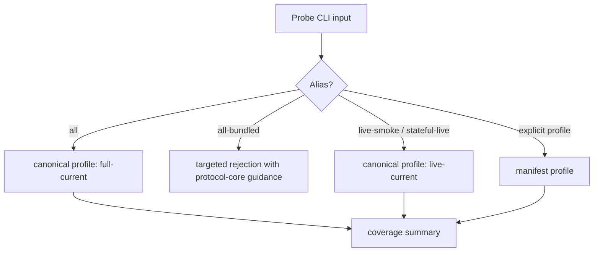
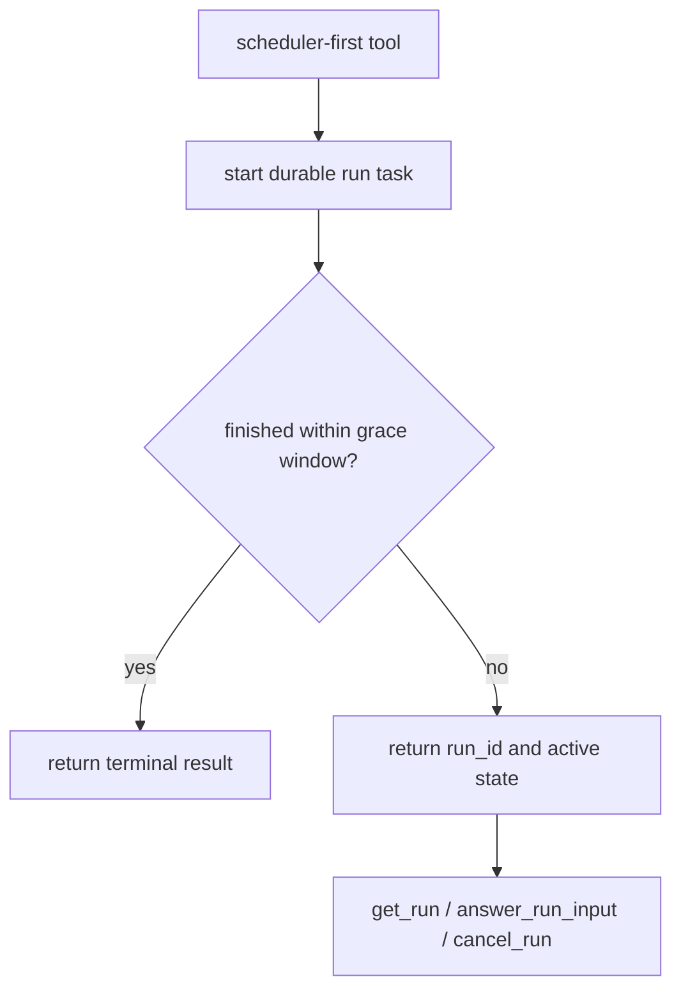

# refactor: Implement revised SAF fixes

Implementation status: applied locally in the current worktree. The implemented surfaces are `running_silent` active liveness, model health basis/gate/action disclosure, repaired observed-probe aliases, first-class `schedule_run`, README alignment, and observed `full-current` scheduler coverage.

## Summary

Implement the repaired SAF set from the current observed-use campaign in two phases: first land the three low-motion fixes that clarify active progress, model health, and coverage aliases; then introduce a scheduler-first run primitive as a separate contract migration. The plan preserves existing MCP compatibility while making the new semantics explicit and testable.

---

## Problem Frame

Observed trials showed that core MCP execution is healthy, but four operator-facing incoherences remain: silent child processes can look stuck, coverage aliases can imply broader coverage than they run, one-shot suitability still depends on lexical routing, and model health output does not explain the basis of `unknown`. The repaired SAF artifact tightened these into four implementation targets with different blast radii.

---

## Requirements

- R1. Active `get_run` views must represent a successfully spawned but silent child as running, not as still starting or waiting for first child output.
- R2. Coverage CLI aliases must not allow `all` to mean a narrower historical profile while `full-current` is the actual current deterministic profile.
- R3. `list_model_classes` must explain whether one-shot health is cached, never probed, or known unhealthy, and must not run probes during listing.
- R4. A scheduler-first run path must create durable task state before child execution and make synchronous return an optimization over that same task.
- R5. Existing public tools must remain usable during migration unless this plan explicitly names a targeted CLI alias rejection.
- R6. Verification must cover deterministic protocol behavior, installed-facing structured output shape, and documentation updates.

---

## Key Technical Decisions

- **Use `running_silent` as the active liveness concept:** A distinct phase is clearer than overloading `running`, and it lets tests assert the precise condition that caused the observed incoherence.
- **Reject `all-bundled` rather than preserving it as a warning-only alias:** Warning-only compatibility was judged asymptotic. A targeted rejection with guidance removes the ambiguity at the command boundary.
- **Keep model health read-only:** `list_model_classes` should annotate cached state, not create provider traffic or mutate health records.
- **Treat scheduler-first execution as a migration, not a quick patch:** It changes the public mental model and should land after the lower-risk SAFs are stable.
- **Keep deterministic and live evidence separated:** Deterministic fake-child scenarios prove protocol mechanics; live-model profiles prove provider integration only where compatible.

---

## High-Level Technical Design

---

## Implementation Units

### U1. Add running-silent active state

- **Goal:** Represent spawned, silent child processes truthfully in active run snapshots.
- **Requirements:** R1, R5.
- **Dependencies:** None.
- **Files:** `src/types.ts`, `src/runTask.ts`, `tests/helpers/fakePiChild.ts`, `tests/run-subagent.test.ts`.
- **Approach:** Add `running_silent` to `RunTaskActivePhase` and use a small helper after `appendChildSpawnEvent` to set `active_phase`, `last_progress_message`, and `last_phase_at` before child output or heartbeat is required. Apply the helper in `startRunTask`, `startSessionRunTask`, and `runSubagentOneShotTask` so all child-backed task paths share the behavior. Keep `child_spawned` as the public event; the new state is a projection, not a repeated public event stream.
- **Execution note:** Add characterization coverage before changing the phase transition so the observed stale `awaiting_child_event` behavior is pinned.
- **Patterns to follow:** Existing `setTaskPhase`, `setTaskProgress`, `appendChildSpawnEvent`, and active heartbeat tests in `tests/run-subagent.test.ts`.
- **Test scenarios:**
  - Start an async run with a fake child that emits no output for less than the heartbeat interval; polling `get_run` after child spawn returns `status:"working"`, `active_phase:"running_silent"`, and `last_progress_message:"child process running; waiting for output"`.
  - Start a session run with the same silent child behavior; active state uses `running_silent` and preserves `session_key`.
  - When the child emits `input_required`, the phase changes from `running_silent` to `input_required` and does not regress.
  - When the child emits assistant output or completes, terminal and output projections remain unchanged.
- **Verification:** The new tests pass without lowering the heartbeat interval, and existing input, cancellation, timeout, terminal, and public event tests remain green.

### U2. Add model health basis and action metadata

- **Goal:** Make `one_shot_health:"unknown"` coherent by explaining the basis and next action in structured output.
- **Requirements:** R3, R5.
- **Dependencies:** None.
- **Files:** `src/modelHealth.ts`, `src/server.ts`, `tests/run-subagent.test.ts`, `README.md`.
- **Approach:** Extend `ModelHealthView` with `health_basis`, `health_gate`, and `health_action`. Return `health_basis:"never_probed"` when no record exists, `health_basis:"cached_probe"` when a record exists, and keep known unhealthy enforcement unchanged. Add top-level default health fields in `listModelClassesResult` so callers do not need to scan `model_classes` to understand the configured default.
- **Patterns to follow:** Existing `modelHealthForClass`, `assertModelClassUsableForOneShot`, and list-model-class MCP tests.
- **Test scenarios:**
  - With no model-health file, every class with no record reports `status:"unknown"`, `health_basis:"never_probed"`, `health_gate:"blocks_only_known_unhealthy"`, and a class-specific probe command.
  - With a cached healthy class, the view reports `health_basis:"cached_probe"` and preserves `last_success_latency_ms`.
  - With a cached unhealthy class, `run_subagent` still rejects known unhealthy one-shot use before child spawn.
  - `list_allowed_models` remains a byte-for-byte structured alias of `list_model_classes`.
  - Top-level default health fields match the default class entry.
- **Verification:** `list_model_classes` performs no child invocation or probe, and README examples describe `unknown` as a non-gating cached-health state.

### U3. Repair observed-probe alias semantics

- **Goal:** Make coverage profile aliases match current coverage semantics.
- **Requirements:** R2, R5, R6.
- **Dependencies:** None.
- **Files:** `scripts/observed-coverage-manifest.json`, `scripts/run-observed-mcp-probe.mjs`, `tests/observed-campaign.test.ts`, `README.md`.
- **Approach:** Remap `all` to `full-current` in the manifest and update CLI usage text. Remove `all-bundled` as a normal alias and add targeted parse-time guidance telling users to run `--profile protocol-core` when they want the historical bundled protocol-core subset. Preserve `live-smoke` and `stateful-live` compatibility aliases to `live-current`.
- **Patterns to follow:** Existing manifest self-checks, alias handling in `parseArgs`, and coverage summary assertions.
- **Test scenarios:**
  - `--profile all` canonicalizes to `profile:"full-current"` and reports no missing deterministic required surfaces.
  - `--scenario all` selects the `full-current` scenario set and reports `scenario_set:"full-current"`.
  - `--scenario all-bundled` rejects with targeted protocol-core guidance before running probe calls.
  - `--profile all-bundled` rejects with the same targeted guidance.
  - Existing `live-smoke` and `stateful-live` alias tests still prove live-mode incompatibility checks.
- **Verification:** README no longer says `all` maps to `protocol-core`, and the deterministic full-current observed campaign remains the canonical broad protocol check.

### U4. Introduce scheduler-first run primitive

- **Goal:** Add the durable-task-first execution path that removes caller prediction from sync versus async routing.
- **Requirements:** R4, R5.
- **Dependencies:** U1.
- **Files:** `src/types.ts`, `src/runTask.ts`, `src/server.ts`, `tests/run-subagent.test.ts`, `README.md`.
- **Approach:** Add a scheduler-first tool surface, tentatively `schedule_run`, that accepts the common run request fields plus an optional bounded wait/grace setting. It should internally create the same durable task state as `start_run`, wait only for the configured grace window, and return either the terminal task view or the active task view with `run_id`. It must not call `assertRunSubagentOneShotCompatible` as the decisive mechanism. Keep `run_subagent` and `start_run` as compatibility tools during migration.
- **Technical design:** Directional only: `schedule_run` should be a thin wrapper around durable task creation plus bounded wait, not a third execution engine.
- **Patterns to follow:** `startRunTask`, `getRunTask`, `runSubagentOneShotTask` terminal hint handling, and MCP tool registration in `src/server.ts`.
- **Test scenarios:**
  - A fast fake child returns a terminal completed task through `schedule_run` when it finishes inside the grace window.
  - A long fake child returns `status:"working"` with `run_id`, `input_requests_dir`, active progress fields, and no preflight rejection for broad-work vocabulary.
  - A scheduled run that later requests input is answerable through `answer_run_input` with the returned `run_id`.
  - A scheduled long run is cancellable through `cancel_run`.
  - `run_subagent` continues to reject broad one-shot work as a compatibility guard until migration documentation changes.
- **Verification:** Scheduler and async paths project from the same task snapshots, and no test needs to special-case a different run storage location.

### U5. Update documentation and migration guidance

- **Goal:** Align public docs with the repaired SAF semantics and avoid stale tool-selection guidance.
- **Requirements:** R2, R3, R4, R5, R6.
- **Dependencies:** U1, U2, U3, U4.
- **Files:** `README.md`.
- **Approach:** Update README tool-selection guidance so `schedule_run` is the preferred default for uncertain work once U4 lands, while `run_subagent` remains the strict quick one-shot compatibility path. Update the observed-campaign README section to state that `full-current` is the deterministic current broad profile and `live-current` is live smoke coverage.
- **Patterns to follow:** Existing README sections for Tool Selection, One-Shot Runs, Async Runs, Model Classes, and Observed Trial Campaigns.
- **Test scenarios:** Test expectation: none -- this unit updates documentation, and behavioral assertions belong to U1-U4.
- **Verification:** Documentation describes the same aliases, model-health fields, and scheduler semantics that the MCP tools and probe script expose.

---

## Scope Boundaries

### In Scope

- Active progress semantics for spawned silent children.
- Structured model-health explanation fields.
- Observed probe alias behavior and docs.
- Scheduler-first tool contract and compatibility guidance.

### Deferred to Follow-Up Work

- Removing `run_subagent` or `start_run`; this plan keeps them as compatibility tools.
- Replacing the task snapshot store with full event sourcing.
- Expanding live-model probes to cover deterministic failure semantics.
- Adding provider probes to model-class listing.

### Out of Scope

- Exposing private model thinking, private tool payloads, or raw internal prompts as progress.
- Changing Pi provider configuration or calibrated model classes.
- Creating branches; this repo should stay on `main` unless explicitly instructed.

---

## Acceptance Examples

- AE1. Given a child process has spawned and has not emitted public output, when a caller polls `get_run`, then the response says the child is running silently rather than still starting.
- AE2. Given no health cache exists for the default class, when a caller invokes `list_model_classes`, then the response says the health basis is `never_probed` and provides a probe action without starting a child run.
- AE3. Given an operator runs the observed probe with `all`, when the probe parses arguments, then it selects `full-current`.
- AE4. Given an operator runs the observed probe with `all-bundled`, when the probe parses arguments, then it rejects with protocol-core guidance and records no misleading coverage result.
- AE5. Given broad synthesis work is submitted through the scheduler-first tool, when it does not finish during the grace window, then the response returns a durable run id instead of a one-shot preflight rejection.

---

## Risks & Dependencies

- **Alias compatibility risk:** Some local scripts may still use `all-bundled`. The targeted rejection should name the replacement command clearly.
- **Scheduler migration risk:** A new tool surface can confuse callers if README guidance is not updated in the same change.
- **Progress-state risk:** `running_silent` must not mask spawn failures; it should only be set after the child spawn event path has succeeded.
- **Structured-output risk:** Adding health fields should be additive so existing callers that only read current fields keep working.

---

## Documentation / Operational Notes

- Update README in the same implementation batch as the behavior it describes.
- Keep campaign reports as historical evidence; do not rewrite past observations to imply they were produced by the new aliases.
- After implementation, run a deterministic `full-current` observed campaign and a live `live-current` smoke campaign to prove the repaired semantics.

---

## Sources / Research

- `reports/full-coherent-revised-saf-set-2026-06-11-codex-current-v2.md` defines the repaired SAF set.
- `reports/selected-saf-adversarial-stress-test-2026-06-11-codex-current.md` classifies the selected SAFs and tightens H1/H2.
- `src/runTask.ts` contains current task snapshot, phase, progress, and public event projection logic.
- `src/modelHealth.ts` contains current cached one-shot health view semantics.
- `scripts/observed-coverage-manifest.json` and `scripts/run-observed-mcp-probe.mjs` contain current profile and alias behavior.
- `tests/run-subagent.test.ts` and `tests/observed-campaign.test.ts` contain the existing MCP and probe coverage patterns to extend.
