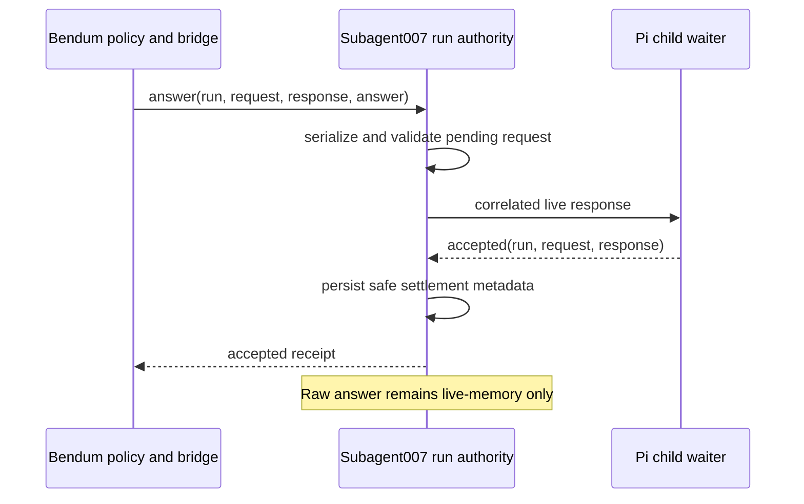

# Single Acknowledged Input Contract

> Historical planning artifact. The Subagent007-side refactor landed in commit `fca5ad0` on 2026-07-11. This document retains its original forward-looking language, including external Bendum acceptance requirements; use [`README.md`](../../README.md) and [`src/durableRunContract.ts`](../../src/durableRunContract.ts) for the current server contract.

## Goal Capsule

Replace the partially implemented v1/v2 caller-input split with one authoritative acknowledged-input contract optimized for Subagent007's current primary customer, Bendum.

The governing order is: repository non-negotiables, the agreed Subagent007/Bendum customer contract, this plan's Product Contract, then existing implementation patterns that do not conflict with the contract reset. This plan cannot relax repository safety or privacy constraints.

Stop if implementation would persist a raw answer in Subagent007-authored operational state, make delivery success weaker than child acceptance, reintroduce a public protocol choice, or require Bendum to infer whether cancellation or answer won a race.

Execution is complete only when Subagent007's existing verification gates pass and the adapted Bendum canary verifies the same contract end to end. Subagent007 owns the provider change; Bendum owns customer adaptation and policy evidence; the Subagent007 executor records the final cross-repository outcome.

---

## Product Contract

### Summary

Caller input is one durable-run capability, not two protocols. Every answer carries a stable response identity, raw answer text crosses only the live control path into Pi, and the returned receipt means the child-side pending-input waiter accepted that response. Bendum admits and records operator interactions under its own policy; Subagent007 provides deterministic delivery, replay, and cancellation behavior.

### Problem Frame

The current prototype adds safer v2 delivery without removing v1. That preserves two public schemas, two settlement paths, mode propagation, compatibility readers, and incomplete parity across run types. It also treats a stream write as delivery even though stream backpressure and concurrent cancellation can make that claim false. Because compatibility is not a requirement and Bendum can adapt, retaining both paths is unjustified complexity.

### Requirements

- R1. Subagent007 exposes one caller-input contract. Public invocation schemas, validation, runtime state, mailbox records, capabilities, tests, and documentation contain no `input_protocol`, v1 branch, v2 branch, legacy answer sidecar, or compatibility reader.
- R2. `answer_run_input` requires `run_id`, `request_id`, `response_id`, and `answer`. A successful result identifies the run, request, response, receipt, and whether the response was newly accepted or replayed.
- R3. A success receipt is created only after the child-side waiter accepts the correlated response. Writing to the child stream, buffering data, or observing backpressure is not sufficient.
- R4. Within a live run, retrying the same request and response identity with the same answer returns the same receipt without redelivery; changing the answer under that identity is rejected. The comparison remains live-memory only.
- R5. Input acceptance, cancellation, run finalization, and pending-request closure share one run-owned ordering authority. The first committed outcome wins and every later operation receives a typed result that distinguishes conflict from closure.
- R6. No Subagent007-authored operational artifact contains raw answer text or a content-derived digest. Pi conversation history and child-authored output may contain answer-derived content because Pi consumes the answer and continuity depends on that context.
- R7. Provider process or child loss does not trigger transparent answer recovery. The affected run fails closed; no persisted answer is reconstructed or redelivered, and the caller must re-enter explicitly.
- R8. The durable-run contract is advertised as version 2 with structural acknowledged-input guarantees, not a v2-named opt-in capability. Contract readiness remains a pre-launch obligation for adapters.
- R9. The contract applies uniformly to one-shot durable runs, resumed runs, named-session runs, and descendant input requests. Session continuity does not create a second input path.
- R10. Bendum removes ambient answer heuristics and treats its durable interaction policy binding as the admission authority. Unexpected input without that Bendum-owned authorization evidence is cancelled and fails closed. Subagent007 validates request identity and lifecycle state, not Bendum policy.
- R11. Provider readiness requires the existing Subagent007 verification gates to cover the contract invariants. Rollout acceptance additionally requires a Bendum-owned cross-repository canary covering readiness, policy-authorized input, replay, cancellation, continuity, and no operational answer leakage.

### Acceptance Examples

- AE1. Given a live pending request, when Bendum submits a new response identity, then Subagent007 returns success only after the Pi child acknowledges that exact request and response identity.
- AE2. Given AE1 has settled, when Bendum retries the same identity and answer, then it receives the original receipt and the child sees no second answer; when it changes the answer, the retry is rejected while the run remains live.
- AE3. Given answer and cancellation arrive concurrently, when answer acceptance commits first, then the request remains answered and cancellation may close only subsequent work; when cancellation commits first, the answer is rejected and never reaches Pi.
- AE4. Given an answer sentinel, when the run completes, fails, cancels, or loses its child, then the sentinel is absent from every Subagent007-authored operational artifact even though it may appear in Pi session history or child-authored output.
- AE5. Given Bendum encounters an unauthorized input request, then it sends no answer, repeatedly discovers, closes, and polls the active runs in that root execution tree until the root is terminal with no active descendants, then requires explicit re-entry.

### Scope Boundaries

In scope are the caller-input public contract, live delivery acknowledgment, request settlement, operation ordering, privacy boundary, session parity, documentation, observed probes, and Bendum acceptance.

Out of scope are compatibility for v1 callers or persisted v1 mailbox records, transparent recovery of orphaned runs, caller-supplied start idempotency, a new cascading cancellation API, migration of Bendum onto named-session APIs, and decomposition of `src/runTask.ts` beyond the caller-input lifecycle and the shared terminal hooks that close it.

The provider and adapted Bendum cut over together after active legacy runs are drained. Production code does not read legacy input artifacts, and contract mismatch rejects before child launch. Historical Bendum ledgers remain readable under Bendum's own contract because they do not persist `input_protocol`.

### Success Criteria

- The public and internal input model has one path and one owner.
- Receipts cannot overstate delivery.
- Answer/cancel races have deterministic, tested outcomes.
- Operational answer non-retention is proven across success and failure surfaces.
- Bendum completes its governed interaction lifecycle without a compatibility shim.

---

## Planning Contract

### Key Technical Decisions

- KTD1. **Breaking contract reset:** bump `subagent007.durable_run` to version 2 and remove the old choice outright. Do not deprecate, alias, ignore, or translate `input_protocol`.
- KTD2. **One request authority:** the mailbox owns safe request and settlement metadata; the live run state owns the ephemeral answer and replay comparison; Pi owns conversational retention after acceptance.
- KTD3. **One acknowledged settlement boundary:** the expected child acknowledges the current run/request/response tuple only after its waiter accepts it. The same run-owned boundary orders that acceptance against cancellation, finalization, and request closure. Transport completion alone never creates a receipt; malformed, mismatched, duplicate, timed-out, or terminal acknowledgments cannot settle the request.
- KTD4. **Live-only strict replay:** retain the accepted answer only in live memory long enough to distinguish exact replay from changed-body conflict. Process loss makes the run terminal, so no cross-restart replay is promised.
- KTD5. **Privacy ownership boundary:** Subagent007 guarantees non-retention for its operational artifacts. Pi session history and child-authored output are outside that guarantee, including ordinary resumed sessions established through `start_run`.
- KTD6. **Origin-run settlement, caller-owned tree shutdown:** a request is settled by its origin run and `cancel_run` stays per-run. Existing `get_run` lineage is the discovery surface Bendum uses to cancel and verify a root tree; no cascading cancellation or new discovery API is added.
- KTD7. **Two existing proof layers:** Subagent007's normal verification gates prove provider behavior; Bendum's adapted canary proves the dominant caller and policy boundary. Both must pass.

### High-Level Technical Design

The same run authority orders cancellation and finalization around this sequence. If the run closes before child acceptance, no success receipt is produced. If child acceptance commits first, replay observes the settled identity and cancellation cannot rewrite the request's history.

### Sequencing

1. Establish the version-2 contract and test vocabulary before changing runtime ownership.
2. Collapse mailbox and run state to one canonical request model.
3. Add child acknowledgment and serialized mutation semantics as one behavioral slice.
4. Apply the same path to sessions and all operational privacy surfaces.
5. Update observed probes and complete the Bendum lockstep canary before declaring the provider repair done.

At the time of planning, the uncommitted v2 implementation was prototype evidence, not a compatibility baseline. Retain the live control channel, stable response identity, and safe receipt metadata; replace protocol branching, file-backed answer settlement, and write-as-delivery semantics.

### Risks and Dependencies

- Child acknowledgment can deadlock or leak waiters if terminal closure is not part of the same ownership model; tests must cover every terminal path.
- A receipt remains evidence of accepted delivery, not proof that the model used the answer or that the run will complete.
- Descendant requests require Bendum to retain root/origin lineage and explicitly close each known run during re-entry; the provider must keep those identities stable.
- Raw answer sentinels can legitimately appear in Pi or child-authored artifacts. Privacy tests must classify artifact ownership instead of asserting impossible end-to-end redaction.
- Bendum adaptation is an external rollout dependency and may evolve in a dirty worktree; coordination must preserve its existing operator-interaction work.

---

## Implementation Units

### U1. Reset the public contract

**Goal:** Make version 2 the only advertised and accepted caller-input contract.

**Requirements:** R1, R2, R8, R9

**Files:** `src/durableRunContract.ts`, `src/types.ts`, `src/server.ts`, `src/validate.ts`, `src/runtimeReadiness.ts`, `tests/run-subagent.test.ts`, `tests/validation.test.ts`, `tests/runtime-readiness.test.ts`, `tests/docs-runtime-facts.test.ts`, `README.md`

**Approach:** Remove protocol selection and obsolete reason codes; require response identity; advertise acknowledged delivery, replay, privacy, and process-loss semantics structurally. Keep the `operation_rejected` envelope while defining distinct stable reason categories for changed-response conflict, already-settled request, cancellation-closed request, and terminal run. Synchronize contract discovery, readiness, source, tests, and README in one unit.

**Test scenarios:** Tool schemas contain no protocol selector; every answer requires response identity; the contract is version 2; removed fields are rejected rather than ignored; conflict/settlement/cancellation/terminal outcomes are distinguishable; readiness and docs facts match the contract; one-shot and session entrypoints advertise the same behavior.

**Dependencies:** None.

### U2. Collapse mailbox and live response state

**Goal:** Give each pending request one safe persisted representation and one ephemeral response owner.

**Requirements:** R1, R4, R6, R7

**Files:** `src/inputMailbox.ts`, `src/runTask.ts`, `tests/input-mailbox.test.ts`, `tests/run-subagent.test.ts`

**Approach:** Delete legacy answer sidecars/readers and protocol branches. Persist only request identity, bounded safe request metadata, response identity, receipt, status, and timestamps under the repository's owner-only storage rules. Keep accepted answer material solely in active memory for live replay comparison, and close rather than recover requests after process loss.

**Test scenarios:** Canonical request creation and settlement; exact live replay; changed-body conflict; no answer or digest in mailbox/run artifacts; old sidecars are neither written nor consumed; restart/loss yields honest terminal behavior without redelivery.

**Dependencies:** U1.

### U3. Make delivery and cancellation authoritative

**Goal:** Ensure receipts and race outcomes describe one committed reality.

**Requirements:** R3, R4, R5, R7

**Files:** `src/processRunner.ts`, `src/piChild.ts`, `src/runTask.ts`, `src/runSubagent.ts`, `tests/helpers/fakePiChild.ts`, `tests/run-subagent.test.ts`

**Approach:** Make child acceptance and run mutation one settlement boundary. A receipt is emitted only for the winning correlated acknowledgment; backpressure is not failure or delivery, and terminal closure resolves every waiter.

**Test scenarios:** Valid, malformed, stale, mismatched, duplicate, and timed-out acknowledgments; stream backpressure without false failure or false receipt; child exit before acknowledgment; answer-first and cancel-first race matrix; finalization during delivery; duplicate suppression; late-answer rejection; no hanging waiter on terminal outcomes.

**Dependencies:** U2.

### U4. Enforce session parity and the privacy boundary

**Goal:** Apply the single contract across continuity modes and prove the operational retention boundary.

**Requirements:** R6, R7, R9

**Files:** `src/session.ts`, `src/runSubagent.ts`, `src/runTask.ts`, `src/transcript.ts`, `src/failureLog.ts`, `tests/run-subagent.test.ts`, `tests/failure-log.test.ts`

**Approach:** Remove any session fallback to a legacy protocol, preserve Pi conversation continuity, and audit every server-authored projection or failure path for raw-answer leakage. Do not redact or rewrite child-authored output under the operational privacy promise.

**Test scenarios:** Fresh, resumed, named-session, and descendant requests use one path; an answer sentinel is absent from Subagent007-authored operational artifacts on success, cancellation, and failure; Pi history may retain the answer; child-authored output remains unchanged.

**Dependencies:** U3.

### U5. Prove the customer contract and record it durably

**Goal:** Make Bendum's adapted workflow the final acceptance test and leave one accurate operating model.

**Requirements:** R8, R10, R11

**Files:** `scripts/run-observed-mcp-probe.mjs`, `scripts/observed-coverage-manifest.json`, `tests/observed-campaign.test.ts`, `README.md`, `.mex/ROUTER.md`, `.mex/context/architecture.md`, `.mex/context/decisions.md`

**Approach:** Replace v2-specific observed coverage with the canonical contract, update existing documentation and project memory, and coordinate the Bendum-owned plan that removes ambient answering and checks readiness on every Subagent007 entry path. Bendum proves authorization through its durable policy binding; Subagent007 does not duplicate that policy engine. Run the cross-repository canary only after provider-local gates are green.

**Test scenarios:** Observed provider behavior covers contract version, acknowledged settlement, replay, races, continuity, and sentinel scanning; Bendum submits only policy-authorized input; unauthorized input fails closed; descendant shutdown reaches quiescence; every Bendum-controlled entry path checks readiness; no operational answer leakage appears in either repository.

**Dependencies:** U4 and completion of the coordinated Bendum adaptation.

---

## Verification Contract

Provider verification runs in this order:

1. `npm run clean:dist`
2. `npm run build`
3. `npm run typecheck`
4. `npm test`
5. `npm run docs:check`
6. `npm run runtime:readiness`
7. `npm run observed-mcp-probe`
8. `npm run observed-campaign`
9. `mex check`

The implementation must also run focused race and privacy tests repeatedly enough to expose nondeterminism, inspect operational artifacts with an answer sentinel, and execute the Bendum-owned canary against the newly built provider. A green provider suite without that canary does not satisfy R11.

---

## Definition of Done

- D1. R1-R11 and AE1-AE5 are traceable to green automated or observed evidence.
- D2. U1-U5 meet their test scenarios and dependency order.
- D3. Public schemas, contract discovery, reason codes, mailbox formats, README, observed coverage, and `.mex` memory describe the same single contract.
- D4. No production reader, fallback, alias, dormant branch, or documentation promise preserves v1 input behavior.
- D5. Receipts are child-acceptance acknowledgments, exact replay is non-delivering, changed live replay rejects, and answer/cancel ordering is deterministic.
- D6. Raw answer sentinels are absent from Subagent007-authored operational artifacts across success and failure paths, with the Pi/child-authored exception documented precisely.
- D7. Provider verification and the adapted Bendum canary pass without `input_protocol`, ambient answer environment variables, or a server-side compatibility shim.
- D8. Abandoned prototype branches, dead code, obsolete fixtures, and superseded v1/v2 documentation are removed from the final diff.
