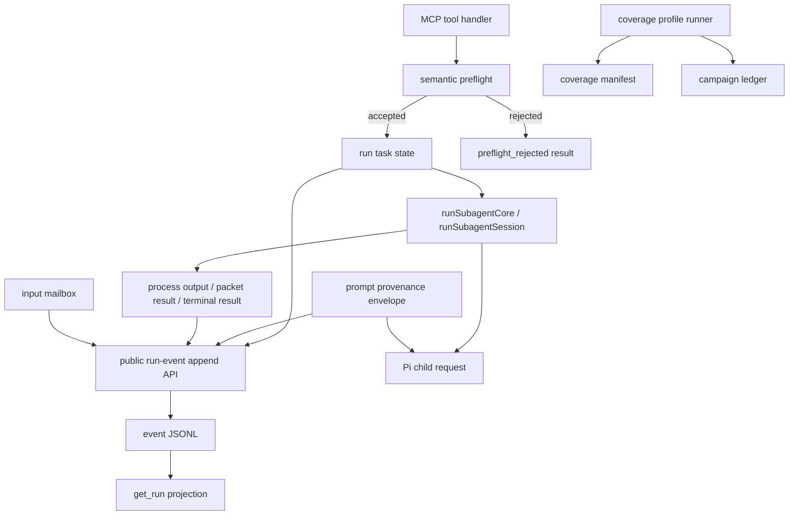

# Coherent Revised SAF Implementation Plan

## Summary

Implement the repaired SAF set from `reports/full-coherent-revised-saf-set-2026-06-11-codex-current.md` as a cohesive reliability and observability slice. The work replaces derived public run state with a single public event append primitive, preserves prompt provenance before child dispatch, normalizes semantic preflight rejections, and makes observed-campaign coverage claims executable.

This plan deliberately avoids a full private event-sourced runtime, a Pi protocol rewrite, or schema loosening beyond what semantic preflight envelopes require.

---

## Problem Frame

The current server execution mechanics are healthy, but several public surfaces remain representationally incoherent. Active run views derive from transcript lines, mailbox state, heartbeat fields, and terminal snapshots; packet contract scaffolding can appear as user-authored prompt text; semantic preflight failures use the MCP error path while terminal failures use structured results; and campaign coverage is partly inferred from script names and report prose.

The repaired SAF set resolves those issues by moving each fix to the earliest malformed representation boundary, while preserving current child process compatibility and the existing MCP tool set.

---

## Requirements

**Run Event Authority**

- R1. Every public run timeline update must flow through one append primitive, not through separate ad hoc `recent_events`, heartbeat, mailbox, or packet projections.
- R2. `get_run` must continue returning bounded `recent_events`, `last_public_output_excerpt`, `last_progress_at`, and `last_progress_message`, but these fields must be projections over the public event ledger.
- R3. Completed run snapshots must remain inspectable after an MCP server restart with their public event history intact.
- R4. Active runs that disappear across server restart may still be reported as failed, but the returned failed view must preserve any previously persisted public events.

**Input Lifecycle**

- R5. Caller input transitions must be durable public run events for requested, answered, timed out, and closed states.
- R6. Public input events must include request identity and status, but must not include answer text.
- R7. `input_requests` remains the authoritative data source for answer content and settlement details.

**Prompt Provenance**

- R8. Public prompt rendering must derive from the caller-authored prompt, not from the composed prompt sent to the Pi child.
- R9. Server-authored contracts such as packet instructions and skill wrappers must be represented as compact public markers, not as user-authored prompt text.
- R10. The Pi child must still receive all contract instructions required for current behavior, including skill binding and packet instructions.

**Semantic Preflight**

- R11. Expected semantic preflight rejections that reach handler logic must return a structured `preflight_rejected` result with `success:false` and `child_started:false`.
- R12. SDK schema validation errors must remain schema errors; child process failures must remain terminal run or session results.
- R13. Failure logging must continue classifying semantic preflight rejections without requiring callers to inspect failure logs for response semantics.

**Campaign Coverage**

- R14. Campaign coverage surfaces, profiles, required/optional status, and evidence classes must be declared as executable data.
- R15. Coverage profiles must fail closed when required surfaces are missing or only covered by the wrong evidence class.
- R16. Deterministic protocol coverage must remain separate from live Pi/provider coverage.
- R17. The coverage manifest must be checked against the repaired SAF surface inventory so omitted required surfaces cannot make a profile pass by absence.

**Compatibility**

- R18. Existing MCP tool names and core successful result fields must remain backward-compatible unless the plan explicitly changes an expected semantic rejection from `isError:true` to structured `preflight_rejected`.
- R19. Raw thinking, private tool payloads, full packet instructions, and input answer text must not be added to public events, public excerpts, output artifacts, or raw public event files.
- R20. Public event text payloads must be bounded so a single child message, prompt, marker, or tool observation cannot create an unbounded public event file.

---

## Key Technical Decisions

- KTD1. **Use a public event ledger, not only in-memory events:** A bounded in-memory list repeats the current issue after restart. A JSONL event file next to each run-task snapshot gives enough durability without replacing the entire task store.
- KTD2. **Keep snapshots as compatibility projections:** `get_run` callers already consume snapshot-shaped views. The event ledger should feed those fields rather than forcing a new MCP contract for ordinary polling.
- KTD3. **Make input lifecycle a producer into the event ledger:** Caller input was previously a separate mailbox projection. It should not become a second event subsystem.
- KTD4. **Use prompt provenance, not transcript redaction, as the prompt fix:** Renderer filtering alone is pseudo-SAF. Store caller prompt and server contracts separately before composing the child prompt.
- KTD5. **Keep the child request contract compatible:** The child can still receive a single composed prompt string. The public renderer must not treat that composed prompt as caller-authored.
- KTD6. **Scope structured rejection to semantic preflight:** MCP schema errors occur before handler code, and terminal child failures mean execution began. A single shape for those would blur useful distinctions.
- KTD7. **Make coverage claims fail closed:** Campaign names and prose summaries are not enough. Profiles need executable required surfaces and evidence-class predicates.
- KTD8. **Separate event semantics from display text:** Cancellation, timeout, packet, input, and terminal states need typed event semantics. Marker strings are display payloads, not the state primitive.

---

## High-Level Technical Design



The design has four boundaries:

- Public run events are the public timeline authority.
- Task snapshots remain compatibility projections.
- Prompt provenance is captured before prompt composition.
- Coverage manifests declare what a campaign must prove.

---

## Implementation Units

### U1. Add Public Run Event Ledger And Projection

- **Goal:** Introduce the single append primitive required by R-SAF-1 without changing high-level tool behavior yet.
- **Files:**
  - `src/types.ts`
  - `src/runEvents.ts` (new)
  - `src/runTask.ts`
  - `tests/run-events.test.ts` (new)
  - `tests/run-subagent.test.ts`
- **Pattern references:**
  - `src/runTask.ts` currently owns `RunTaskView`, `recentEvents`, `lastPublicOutputExcerpt`, and task snapshot persistence.
  - `src/output.ts` provides `defaultSubagentStatePath`; reuse path conventions instead of adding an unrelated state root.
- **Design notes:**
  - Add a `RunPublicEvent` schema version and expand event kinds beyond transcript roles. Suggested public kinds: `task`, `child`, `user`, `assistant`, `warning`, `error`, `input`, `packet`, and `terminal`.
  - Give state-significant events typed `event` values, for example `run_started`, `child_spawned`, `input_required`, `input_answered`, `input_closed`, `timeout`, `cancellation_requested`, `cancellation_settled`, `packet_accepted`, `packet_rejected`, `completed`, and `failed`.
  - Store event files under the run-task state root, for example `run-tasks/<runId>.events.jsonl`, so `SUBAGENT007_RUN_TASKS_DIR` keeps snapshots and public event history together.
  - Add helpers for append, read, bounded projection, and excerpt calculation. Projection should preserve the current `MAX_RECENT_EVENTS` and `MAX_PUBLIC_OUTPUT_EXCERPT_CHARS` behavior unless tests show a reason to change the limits.
  - Apply redaction and per-event public text truncation before writing the event JSONL file, not only while projecting `get_run`.
  - Keep old snapshots readable. If an existing snapshot has `recent_events` but no event file, `get_run` should still return the snapshot's fields.
- **Test scenarios:**
  - `tests/run-events.test.ts`: appending multiple events creates JSONL records in order and projection returns the last bounded events.
  - `tests/run-events.test.ts`: excerpt projection is tail-bounded and stable across process reads.
  - `tests/run-events.test.ts`: a single overlong public text payload is capped in the raw JSONL record and in projections.
  - `tests/run-events.test.ts`: malformed or missing event file fails closed to an empty event projection or clear validation error without corrupting task snapshots.
  - `tests/run-subagent.test.ts`: completed run remains inspectable after server restart and includes public events loaded from the event file.
  - `tests/run-subagent.test.ts`: an active snapshot read after restart preserves stored public events while still reporting the run as failed due to process loss.
  - `tests/run-subagent.test.ts`: raw thinking text is absent from raw event JSONL, `recent_events`, excerpt, and output artifact.

### U2. Wire Execution, Terminal, Packet, And Cancellation Producers

- **Goal:** Route lifecycle and child output observations through the event append primitive from U1.
- **Files:**
  - `src/runTask.ts`
  - `src/runSubagent.ts`
  - `src/processRunner.ts`
  - `src/session.ts`
  - `src/transcript.ts`
  - `tests/run-subagent.test.ts`
  - `tests/session.test.ts`
  - `tests/timeout-budget.test.ts`
- **Pattern references:**
  - `src/processRunner.ts` already emits output lines through `onOutputLine`.
  - `src/runTask.ts` already writes snapshots from `observeOutputLine`, heartbeat callbacks, cancellation, and terminal settlement.
  - `src/session.ts` already has packet parse and gate result fields after `writePacket`.
- **Design notes:**
  - Append `task` and `child` events when a run task starts and before child process spawn.
  - Convert `publicOutputLineFromProcessLine` results into event ledger appends instead of mutating `state.recentEvents` directly.
  - Append timeout and cancellation as status-significant typed events, with distinct semantics for `cancellation_requested` and terminal cancellation settlement.
  - Append a terminal event after result/error settlement even though the run is terminal. Do not block terminal events with the current `terminalSnapshotStarted` guard.
  - For session tasks, append a packet event after `runSubagentSession` returns, including `packet_parse_status`, gate outcome, and whether the attempt committed. Do not duplicate full packet JSON in public event text.
  - Derive `last_progress_message` from the latest status-significant event. Avoid stale `running` after input, timeout, cancellation, completion, or packet failure.
- **Test scenarios:**
  - `tests/run-subagent.test.ts`: a long fake child run exposes task/child events before terminal output.
  - `tests/run-subagent.test.ts`: timeout run records a timeout event, `status:"failed"`, and `last_progress_message` that names timeout rather than `running`.
  - `tests/run-subagent.test.ts`: cancelled run records separate `cancellation_requested` and terminal `cancellation_settled` events.
  - `tests/session.test.ts`: required packet success records packet accepted/committed event.
  - `tests/session.test.ts`: required packet non-ready and invalid closure record packet rejected events without committing manifest.
  - `tests/timeout-budget.test.ts`: timeout metadata and hard caller cap behavior remain unchanged.

### U3. Fold Caller Input Lifecycle Into The Event Model

- **Goal:** Make input request lifecycle visible as durable public timeline events while preserving mailbox authority.
- **Files:**
  - `src/piChild.ts`
  - `src/inputMailbox.ts`
  - `src/runTask.ts`
  - `src/transcript.ts`
  - `tests/input-mailbox.test.ts`
  - `tests/run-subagent.test.ts`
  - `tests/helpers/fakePiChild.ts`
- **Pattern references:**
  - `src/piChild.ts` owns the `request_input` tool and can emit structured stdout events.
  - `src/inputMailbox.ts` owns settlement files and duplicate-settlement behavior.
  - `src/runTask.ts` currently synthesizes transient pending-input events in `eventsForView`.
- **Design notes:**
  - Emit `subagent007.input_request` from `piChild.ts` immediately after `createInputRequest`, containing request id, question summary, option count, and freeform flag.
  - Emit `subagent007.input_answered` after `waitForInputAnswer` returns, without answer text.
  - Emit `subagent007.input_timed_out` or `subagent007.input_closed` when `waitForInputAnswer` throws those known states, then rethrow so run failure semantics remain unchanged.
  - Append `input_closed` events from `runTask.ts` after `closePendingInputRequestsForRun` returns during cancellation or terminal cleanup.
  - Update `last_progress_message` immediately when durable input events are appended; do not rely on heartbeat timing for the active view to show that input is required or settled.
  - Remove the transient pending-only event synthesis from `eventsForView` once durable input events are in place, or keep it only as a backward-compatibility fallback when no event file exists.
- **Test scenarios:**
  - `tests/run-subagent.test.ts`: caller-input run records `input_required` and `input_answered` events in order, with no answer text in raw event JSONL, `recent_events`, or excerpt.
  - `tests/run-subagent.test.ts`: answering input updates `input_requests` and keeps the prior input-required event visible.
  - `tests/run-subagent.test.ts`: cancellation with pending input records `input_closed` and rejects late answers.
  - `tests/input-mailbox.test.ts`: mailbox duplicate-answer, timeout, and closed semantics remain unchanged.
  - `tests/run-subagent.test.ts`: input-required progress is visible immediately after the input event and does not require a heartbeat tick.

### U4. Add Prompt Provenance Envelope

- **Goal:** Prevent server-authored contract scaffolding from being represented as caller-authored prompt content.
- **Files:**
  - `src/types.ts`
  - `src/prompt.ts`
  - `src/packet.ts`
  - `src/validate.ts`
  - `src/runSubagent.ts`
  - `src/session.ts`
  - `src/piChild.ts`
  - `src/transcript.ts`
  - `src/output.ts`
  - `tests/validation.test.ts`
  - `tests/run-subagent.test.ts`
  - `tests/session.test.ts`
  - `tests/helpers/fakePiChild.ts`
- **Pattern references:**
  - `src/prompt.ts` currently composes skill syntax around the prompt.
  - `src/session.ts` currently appends packet instructions directly into `resolved.prompt`.
  - `src/piChild.ts` currently calls `composePrompt` again before `session.prompt`.
  - `src/output.ts` writes final/transcript artifacts from either final message or processed transcript.
- **Design notes:**
  - Introduce a prompt provenance type that carries:
    - `public_prompt`: normalized caller-authored prompt;
    - `skill_name` or compact skill contract marker;
    - packet policy and compact packet contract marker when applicable;
    - `composed_child_prompt`: the actual prompt string sent to Pi.
  - Use stable compact public markers for server-authored prompt contracts:
    - skill marker: `[server_contract] skill_name=<name>`;
    - packet marker: `[server_contract] packet_policy=<policy> contract_packet_v1 instruction applied`.
  - Ensure composition occurs once. Avoid layering packet instructions in `session.ts` and skill wrappers in `piChild.ts` in a way that makes provenance hard to reason about.
  - Pass provenance metadata through the child request file while preserving the existing `prompt` field as the child-compatible composed prompt, unless a more compatible migration path is clearer during implementation.
  - Public event projection should append the caller prompt from provenance at task start and ignore child-emitted `user` message_end events that echo the composed prompt.
  - Transcript artifact preparation must also avoid rendering the composed child prompt as user-authored content. Add an override or filter in `preparePublicTranscriptFromProcessOutput` / `writeRunOutput` so output files match `get_run` public provenance.
  - Preserve full contract instructions in the child request and fake-child logs for deterministic verification, but do not put them in public events or transcript artifacts.
- **Test scenarios:**
  - `tests/session.test.ts`: required packet valid run still succeeds and fake child sees packet instruction.
  - `tests/run-subagent.test.ts`: `recent_events` for packet runs contains original caller prompt plus compact packet marker, not full `<subagent007_contract_packet>` block.
  - `tests/run-subagent.test.ts`: transcript output file for packet runs omits full packet instruction while retaining assistant packet output.
  - `tests/run-subagent.test.ts`: skill-bound run public prompt distinguishes caller prompt from server-applied skill marker.
  - `tests/validation.test.ts`: prompt composition remains deterministic and bare skill validation remains unchanged.
  - `tests/helpers/fakePiChild.ts`: request logging proves child receives the composed prompt, full packet instruction or skill wrapper, and provenance metadata.
  - `tests/run-subagent.test.ts`: public provenance events contain only stable compact markers, while fake-child request logs prove the full internal contract reached the child.

### U5. Return Structured Semantic Preflight Rejections

- **Goal:** Replace expected handler-level semantic rejection errors with structured `preflight_rejected` responses while preserving schema and terminal failure distinctions.
- **Files:**
  - `src/types.ts`
  - `src/server.ts`
  - `src/runTask.ts`
  - `src/validate.ts`
  - `src/modelHealth.ts`
  - `src/failureLog.ts`
  - `tests/run-subagent.test.ts`
  - `tests/failure-log.test.ts`
  - `tests/observed-campaign.test.ts`
  - `scripts/run-observed-mcp-probe.mjs`
- **Pattern references:**
  - `src/server.ts` currently wraps successful responses with `jsonToolResult` and throws validation errors through `withFailureLogging`.
  - `src/failureLog.ts` already maps validation messages to reason codes.
  - `scripts/run-observed-mcp-probe.mjs` currently classifies schema, handler, and child failures separately.
- **Design notes:**
  - Add a structured type for semantic preflight rejection results with fields from R-SAF-3: `status:"rejected"`, `kind:"preflight_rejected"`, `success:false`, `child_started:false`, `error_class`, `reason_code`, `message`, and optional retry guidance.
  - Centralize conversion from expected `ValidationError` sources to this result shape. Do not catch schema errors emitted by the MCP SDK before handler invocation.
  - Use this envelope for expected semantic rejections such as broad one-shot, skill-bound one-shot, prompt-level skill syntax, invalid semantic session input, known unhealthy one-shot model class, and invalid cwd after handler invocation.
  - Preserve failure logging for semantic preflight rejections, but do not force callers to inspect logs to understand the response.
  - Keep nonzero child exits, timeouts, cancellation, packet failures, and missing session events as terminal run/session results.
- **Test scenarios:**
  - `tests/run-subagent.test.ts`: broad `run_subagent` returns `structuredContent.kind === "preflight_rejected"` and `child_started === false`, and fake child is not invoked.
  - `tests/run-subagent.test.ts`: skill-bound one-shot and known-unhealthy model class return structured preflight rejection.
  - `tests/run-subagent.test.ts`: missing required `run_kind` remains `isError:true` schema validation.
  - `tests/run-subagent.test.ts`: child failure remains `status:"failed"` with `child_started` absent or true, not a preflight rejection.
  - `tests/failure-log.test.ts`: preflight rejection still writes one classified validation failure record when failure logging is enabled.
  - `tests/observed-campaign.test.ts`: probe ledger distinguishes `call_schema_error`, `call_preflight_rejected`, and terminal `call_result`.

### U6. Add Coverage Manifest And Profile Runner

- **Goal:** Make observed campaign coverage executable and fail-closed by profile and evidence class.
- **Files:**
  - `scripts/run-observed-mcp-probe.mjs`
  - `scripts/run-observed-campaign.mjs`
  - `scripts/observed-coverage-manifest.json` (new, or `.mjs` if computed constants are preferred)
  - `package.json`
  - `README.md`
  - `tests/observed-campaign.test.ts`
- **Pattern references:**
  - `scripts/run-observed-mcp-probe.mjs` already has `PRODUCT_SURFACES`, `SCENARIO_REGISTRY`, modes, coverage summaries, and deterministic fake-child injection.
  - `scripts/run-observed-campaign.mjs` already scopes state paths and prints campaign metadata.
- **Design notes:**
  - Move product surfaces and scenario-to-surface mapping into an executable manifest consumed by the probe.
  - Add named profiles:
    - `protocol-core`: deterministic fake-child success/schema/preflight/child-failure/packet-failure/transcript-redaction subset.
    - `live-smoke`: live Pi-backed one-shot and model listing with no fake child.
    - `stateful-live`: live Pi-backed async/input/cancel/timeout/continuity/session/packet/skill subset.
    - `full-current`: all required current surfaces with deterministic and live evidence separated.
  - Rename `all-bundled` to `protocol-core`, keeping `all-bundled` and `all` as compatibility aliases that report the canonical profile name.
  - Treat live provider/Pi scenarios as separate evidence class from deterministic protocol scenarios. Do not let live-model mode run deterministic-only scenarios.
  - Replace or rename `installed-pi-integration` if the automated script only proves live Pi integration through a local stdio server. Avoid claiming active Codex-installed MCP coverage unless a real installed-server adapter is added.
  - Add a manifest self-check that compares declared surfaces against the repaired SAF surface inventory from `reports/full-coherent-revised-saf-set-2026-06-11-codex-current.md`; missing SAF-required surfaces must fail before campaign execution.
  - Profile output must include required, optional, out-of-scope, skipped, covered, and missing surfaces. Required missing surfaces must exit nonzero.
- **Test scenarios:**
  - `tests/observed-campaign.test.ts`: `protocol-core` passes deterministic scenarios and reports live surfaces out of scope.
  - `tests/observed-campaign.test.ts`: compatibility alias `all-bundled` maps to canonical `protocol-core`.
  - `tests/observed-campaign.test.ts`: a profile exits nonzero when a required surface has no recorded call result.
  - `tests/observed-campaign.test.ts`: manifest self-check fails when a SAF-required surface is omitted from the manifest.
  - `tests/observed-campaign.test.ts`: deterministic-only scenarios are rejected in live mode.
  - `tests/observed-campaign.test.ts`: coverage output separates evidence classes and lists skipped/out-of-scope surfaces.
  - `README.md`: documented commands align with the new profile names and no longer imply all-bundled/full coverage from the deterministic subset.

### U7. Documentation And Final Integration Pass

- **Goal:** Keep public docs, report terminology, and test commands aligned with the repaired architecture.
- **Files:**
  - `README.md`
  - `reports/full-coherent-revised-saf-set-2026-06-11-codex-current.md`
  - `docs/plans/coherent-revised-saf-implementation-plan-2026-06-11-codex-current.md`
  - `tests/run-subagent.test.ts`
  - `tests/session.test.ts`
  - `tests/observed-campaign.test.ts`
- **Pattern references:**
  - `README.md` already explains run-task snapshots, active events, prompt skill binding, named sessions, packet policy, and observed campaigns.
- **Design notes:**
  - Update README sections for active run events, semantic preflight results, prompt provenance behavior, and coverage profiles.
  - Keep historical report files as historical artifacts; do not rewrite old observations to sound like current behavior.
  - Add a short migration note for clients: semantic preflight rejections now return structured content instead of MCP handler errors for supported semantic cases.
- **Test scenarios:**
  - Documentation review confirms no command still claims `all-bundled` is full product coverage.
  - `npm run typecheck` passes.
  - `npm test` passes.
  - `npm run observed-campaign -- --campaign-id <id> -- npm run observed-mcp-probe -- --server ./dist/server.js --cwd <repo> --profile protocol-core` passes.
  - If live Pi credentials are available, `live-smoke` passes; if not, it fails with explicit missing live evidence rather than green partial coverage.

---

## Acceptance Examples

- AE1. Given a live or fake child run that waits before final output, when `get_run` is polled while active, then the response includes task/child lifecycle events and a progress message derived from the latest public event.
- AE2. Given a caller-input run, when the child requests input and the caller answers, then `recent_events` retains both requested and answered events without answer text.
- AE3. Given a required packet run, when public events and output artifact are inspected, then the caller prompt is visible and packet policy is summarized, but the full packet instruction scaffold is absent.
- AE4. Given a broad one-shot request, when `run_subagent` handles it, then the response is structured `preflight_rejected`, `child_started:false`, and the fake child log is absent.
- AE5. Given a nonzero child failure, when `run_subagent` handles it, then the response remains a terminal failed run and is not classified as preflight rejection.
- AE6. Given `protocol-core`, when the deterministic campaign finishes, then live Pi/provider surfaces are explicitly out of scope rather than uncovered failure.
- AE7. Given `full-current`, when a required surface is missing, then the profile exits nonzero and lists the missing surface.

---

## System-Wide Impact

- Public MCP response semantics change for expected semantic validation failures that currently appear as handler errors.
- Run-task state gains a durable public event file per run.
- Public transcript generation must become provenance-aware, not just raw process-output based.
- The child request file may gain provenance metadata while retaining the existing composed prompt path.
- Campaign scripts become stricter and may fail runs that previously produced green partial summaries.

---

## Risks And Dependencies

| Risk | Impact | Mitigation |
| --- | --- | --- |
| Event ledger duplicates or misorders events | Polling becomes noisier than current snapshots | Use one append API and test ordered task/input/terminal sequences. |
| Event ledger grows from one large public payload | State files can become expensive or leak large public text | Cap public text before JSONL append and test raw file bounds. |
| Prompt provenance breaks packet or skill behavior | Child loses contract instructions | Keep composed child prompt compatibility and verify fake-child request logs. |
| Public transcript artifact still includes composed prompt | R-SAF-2 remains incomplete | Update output/transcript path, not only active events. |
| Semantic rejection envelopes break clients expecting `isError:true` | Client compatibility risk | Document the change and limit it to expected semantic preflight cases. |
| Coverage manifest validates only itself | Required surfaces can disappear from both test and manifest | Self-check manifest against the repaired SAF surface inventory. |
| Coverage profiles become too environment-sensitive | CI or local campaigns fail unpredictably | Separate deterministic `protocol-core` from live profiles and require explicit skips. |
| Live installed MCP coverage is not script-addressable | Coverage claims can overreach again | Define automated live Pi coverage precisely; do not claim active installed Codex-server coverage without an adapter. |

---

## Scope Boundaries

**In scope**

- Public event ledger and `get_run` projection.
- Redacted input lifecycle events.
- Prompt provenance for public events and transcript artifacts.
- Structured semantic preflight rejection results.
- Executable coverage manifests and profile enforcement.
- Focused README updates.

**Out of scope**

- Full private event sourcing for every internal runtime detail.
- Changing or removing existing MCP tool names.
- Exposing raw thinking, private tool payloads, full server contract prompts, or input answer text.
- Weakening SDK schema validation solely for uniform response shape.
- Replacing Pi's model/session internals.

---

## Verification Plan

Run after implementation:

```bash
npm run build
npm run typecheck
npm test
npm run observed-campaign -- --campaign-id campaign.verify-protocol-core -- npm run observed-mcp-probe -- --server ./dist/server.js --cwd "$PWD" --profile protocol-core
```

When live Pi auth is available, also run the live profile selected by the implementation, for example:

```bash
npm run observed-campaign -- --campaign-id campaign.verify-live-smoke -- npm run observed-mcp-probe -- --server ./dist/server.js --cwd "$PWD" --profile live-smoke
```

---

## Sources And Code References

- `reports/observed-real-use-trials-2026-06-11-codex-current.md`
- `reports/saf-adversarial-stress-test-2026-06-11-codex-current.md`
- `reports/full-coherent-revised-saf-set-2026-06-11-codex-current.md`
- `src/runTask.ts`
- `src/runSubagent.ts`
- `src/session.ts`
- `src/piChild.ts`
- `src/inputMailbox.ts`
- `src/transcript.ts`
- `src/output.ts`
- `src/server.ts`
- `scripts/run-observed-mcp-probe.mjs`
- `scripts/run-observed-campaign.mjs`
- `tests/run-subagent.test.ts`
- `tests/session.test.ts`
- `tests/input-mailbox.test.ts`
- `tests/observed-campaign.test.ts`
