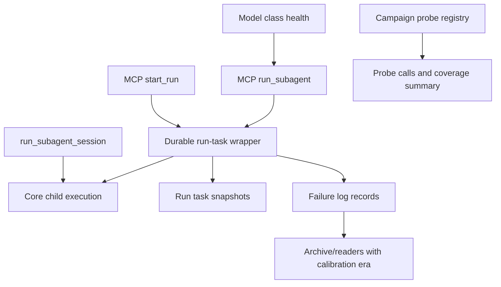

# Coherent Revised SAF Implementation Plan

Status note: this plan has been implemented in the current worktree. Its named-session task boundary was later superseded by `docs/plans/current-coherent-revised-saf-implementation-plan-2026-06-11.md`, which made named sessions durable and pollable. This file remains as traceability for the earlier repaired June 11 SAF set, not as an open task list or current architecture contract.

## Summary

Implement the five revised SAFs as a coherent reliability and observability slice for the Subagent007 MCP server. The plan keeps the revised SAF scopes intact: one-shot model health, durable one-shot lifecycle identity, active-run liveness snapshots, first-class campaign coverage semantics, and calibration-era failure analysis.

The work should land in ordered units because later units depend on clearer run lifecycle and telemetry boundaries established by earlier ones.

---

## Problem Frame

The June 11 observed-use campaign found that the core lifecycle repairs from June 10 held, but the remaining defects were boundary and authority problems. The revised SAF set corrected earlier overclaims by narrowing the HORCs and naming residual routing problems explicitly.

Implementation must preserve that discipline. This plan does not attempt full task-aware scheduling, full semantic progress detection, or full product-surface campaign coverage. It implements the exact root repairs named in `reports/full-coherent-revised-saf-set-2026-06-11.md`.

Planning-time correction: code research shows `start_run` already installs an internal heartbeat callback through `runTask.ts`; the observed installed `heartbeat_count:0` came from snapshot semantics and the 30-second default interval, not absence of an internal callback. R-SAF-3 should therefore be implemented as immediate and internally owned active-run snapshot visibility, plus tests proving it does not depend on MCP progress tokens.

---

## Requirements

### One-Shot Model Health

- R1. Model inventory presence must remain separate from one-shot execution health.
- R2. `list_model_classes` must report one-shot health state for every model class without implying unknown health is successful health.
- R3. `run_subagent` must fail fast before spawning a child when the selected model class is known unhealthy for the one-shot surface.
- R4. Health records must be state-root scoped and testable without touching production state.

### Durable One-Shot Identity

- R5. Public `run_subagent` calls must create durable run-task snapshots addressable through `get_run`.
- R6. `run_subagent` timeout and failure metadata must come from the same lifecycle authority used by `start_run`.
- R7. Internal callers such as named sessions must continue to use a core child-execution primitive without accidentally creating public run-task wrappers.
- R8. Failure logging must keep the public tool name `run_subagent` for public one-shot failures and avoid duplicate records.

### Active-Run Liveness

- R9. Active `start_run` snapshots must expose liveness metadata immediately after task creation, even when no MCP progress token exists.
- R10. Heartbeat/progress notification fan-out must remain optional and must not be the source of snapshot liveness truth.
- R11. Terminal snapshots must not be overwritten by late heartbeat updates.

### Campaign Coverage Semantics

- R12. Bundled probe scenarios must be declared through a registry with coverage metadata.
- R13. Probe output must distinguish `all-bundled` from product-complete E2E coverage.
- R14. Probe output must include computed covered and uncovered surfaces.
- R15. Campaign reports and README guidance must cite the computed coverage semantics rather than relying on prose.

### Calibration-Era Failure Analysis

- R16. New failure records must carry a single explicit calibration-era field.
- R17. Failure-log readers must classify missing-era records as `legacy_unclassified`.
- R18. Archive summaries must segment by calibration era.
- R19. Existing historical logs must not be destructively rewritten.

---

## Key Technical Decisions

- KTD1. Split public wrapper from child-execution core: keep the current process-running behavior as a core function and make public `run_subagent` use run-task persistence. This prevents named sessions from inheriting public one-shot wrapper semantics.
- KTD2. Health state is advisory unless explicitly unhealthy: unknown health should be reported as unknown, not treated as failure. Known unhealthy records fail fast for `run_subagent`; known healthy records only support reporting and should not bypass normal timeout/failure handling.
- KTD3. One-shot health is scoped to `run_subagent_one_shot`: avoid claiming broad model capability or task-aware routing. Future scheduler work can add more surfaces.
- KTD4. Liveness snapshots start immediately: set a sanitized progress message and timestamp at task creation, then continue heartbeat updates on the configured interval.
- KTD5. Probe coverage is data, not prose: scenario coverage metadata should be computed from a registry used by the CLI parser and output summary.
- KTD6. Calibration era belongs to both writers and readers: adding a field to new records is incomplete unless archive/report readers classify missing fields as legacy.

---

## High-Level Technical Design

The key separation in this earlier plan was between the durable public lifecycle wrapper and the core child execution primitive. `start_run` and public `run_subagent` shared task snapshot semantics while `run_subagent_session` stayed on the core path. That named-session boundary is superseded by the current plan: `run_subagent_session` now acts as a compatibility wrapper around the durable session task lifecycle, while packet-gated candidate-session promotion remains protected inside the session executor.

---

## Implementation Units

### U1. Normalize Active Run Liveness Snapshots

- **Covers:** R9, R10, R11; R-SAF-3.
- **Goal:** Make active task liveness visible immediately through `get_run`, independent of progress-token notification delivery.
- **Files:**
  - `src/runTask.ts`
  - `src/progress.ts`
  - `tests/run-subagent.test.ts`
  - `README.md`
- **Approach:**
  - Initialize `last_progress_at` and `last_progress_message:"running"` when `startRunTask` creates task state.
  - Keep `heartbeat_count` at `0` until the first interval tick, or explicitly document and test if the implementation chooses to count the initial progress as beat `0`.
  - Preserve the existing fan-out to `options.heartbeat`; it remains notification plumbing only.
  - Guard snapshot writes so terminal states are not replaced by late heartbeat updates.
- **Test scenarios:**
  - Starting a fake long run with no MCP progress token returns `last_progress_at` and `last_progress_message` immediately.
  - A run shorter than `DEFAULT_HEARTBEAT_INTERVAL_MS` still has active liveness fields before completion.
  - A long run with `SUBAGENT007_HEARTBEAT_INTERVAL_MS=25` still increments `heartbeat_count`.
  - After terminal completion, repeated `get_run` calls return stable terminal metadata.
- **Verification:** `npm run typecheck && npm test`, plus installed smoke if available: `start_run` then immediate `get_run` should show liveness fields before any 30-second heartbeat tick.

### U2. Route Public `run_subagent` Through Durable Task Snapshots

- **Covers:** R5, R6, R7, R8; R-SAF-2.
- **Goal:** Make public one-shot runs inspectable through `get_run` after timeout or failure while keeping session internals on a core execution path.
- **Files:**
  - `src/runSubagent.ts`
  - `src/runTask.ts`
  - `src/server.ts`
  - `src/types.ts`
  - `src/session.ts`
  - `tests/run-subagent.test.ts`
  - `tests/session.test.ts`
  - `tests/failure-log.test.ts`
  - `tests/timeout-budget.test.ts`
  - `README.md`
- **Approach:**
  - Extract the current `runSubagent` process execution into a clearly named core primitive such as `runSubagentCore`.
  - Update `startRunTask` and `runSubagentSession` to call the core primitive.
  - Add a public one-shot wrapper for MCP `run_subagent` that creates a durable task record and waits synchronously for terminal completion under the existing one-shot timeout behavior.
  - Ensure terminal `run_subagent` results and `get_run` snapshots share the same `run_id`, output path, failure metadata, input request directory, and timeout fields.
  - Keep `run_subagent` rejecting caller-provided `timeout_ms`; this plan does not reintroduce public one-shot timeout control.
  - Ensure failure logs record the public tool as `run_subagent`, not `start_run`, and are written once.
- **Test scenarios:**
  - A fake one-shot timeout returns `timed_out:true`, a durable `run_id`, and a `timeout_recovery_hint`.
  - `get_run` for that `run_id` after the `run_subagent` response returns the same terminal metadata.
  - A fake nonzero one-shot failure is logged once as `tool:"run_subagent"`.
  - A successful quick `run_subagent` result remains backward-compatible in structured fields.
  - Historical note: this plan originally kept `run_subagent_session` outside public run-task snapshots. The current architecture supersedes that by wrapping named sessions in durable session tasks while preserving candidate-attempt ledger and packet-promotion semantics.
- **Verification:** Existing session tests must still pass, proving the core/public split did not contaminate named-session semantics.

### U3. Add One-Shot Model-Class Health Boundary

- **Covers:** R1, R2, R3, R4; R-SAF-1.
- **Goal:** Stop conflating inventory presence with one-shot readiness, especially for class `A`.
- **Files:**
  - `src/modelAllowlist.ts`
  - `src/modelHealth.ts`
  - `src/config.ts`
  - `src/output.ts`
  - `src/server.ts`
  - `src/validate.ts`
  - `scripts/reconcile-models.mjs`
  - `scripts/probe-model-health.mjs`
  - `tests/validation.test.ts`
  - `tests/run-subagent.test.ts`
  - `tests/config-migrate.test.ts`
  - `README.md`
- **Approach:**
  - Add `src/modelHealth.ts` for state-root-scoped health records under a path such as `SUBAGENT007_MODEL_HEALTH_PATH` or a default state leaf.
  - Define a stable health schema keyed by `{ model_class, resolved_model, surface }`, initially with `surface:"run_subagent_one_shot"`.
  - Add helper functions to read, write, and classify health as `healthy`, `unhealthy`, or `unknown`.
  - Extend `list_model_classes` output with one-shot health fields. Unknown health must be visible as unknown.
  - Add preflight in public `run_subagent` validation or wrapper: known unhealthy class for `run_subagent_one_shot` fails before child spawn with a clear reason.
  - Add `scripts/probe-model-health.mjs` as the operational path to run a smoke and write health state. Tests can use fake child or direct state fixture rather than live Pi.
  - Keep `npm run models:reconcile` inventory-focused; optionally make its output mention health is separate, but do not blend the two signals.
- **Test scenarios:**
  - With no health record, `list_model_classes` reports health `unknown` and `run_subagent` can proceed.
  - With an unhealthy class `A` record for `run_subagent_one_shot`, public `run_subagent` fails before fake child invocation.
  - With an unhealthy class `A` record, `list_model_classes` reports `usable_for_one_shot:false`.
  - With a healthy record, `list_model_classes` reports health without bypassing normal execution.
  - `npm run models:reconcile` still passes when health marks a present model unhealthy.
- **Verification:** Reproduce the class `A` installed failure as a health record and verify the next class `A` one-shot fails fast instead of waiting for the process timeout.

### U4. Introduce Campaign Probe Coverage Registry

- **Covers:** R12, R13, R14, R15; R-SAF-4.
- **Goal:** Make bundled probe coverage machine-readable and prevent `all` from being mistaken for full product coverage.
- **Files:**
  - `scripts/run-observed-mcp-probe.mjs`
  - `scripts/run-observed-campaign.mjs`
  - `tests/observed-campaign.test.ts`
  - `README.md`
  - `reports/observed-real-use-trials-2026-06-11.md`
- **Approach:**
  - Replace the bare `SCENARIOS` set with a scenario registry object.
  - Give each scenario coverage tags: tools, lifecycle phases, evidence class, success/failure classes, and known excluded surfaces.
  - Treat `--scenario all` as a compatibility alias for `all-bundled`, but output `scenario_set:"all-bundled"` and the expanded scenario list.
  - Compute `covered_surfaces` and `uncovered_surfaces` from the registry.
  - Keep probe argument redaction unchanged; coverage metadata must not add prompt text or sensitive arguments.
  - Update README and report language so future observed campaigns cite the computed coverage summary.
- **Test scenarios:**
  - Default probe output includes `scenario_set:"all-bundled"`.
  - Repeated `--scenario` calls produce a coverage summary for only selected scenarios.
  - `uncovered_surfaces` includes async input, cancellation, timeout recovery, transcript redaction, valid packet closure, and installed Pi integration when those are not selected.
  - Ledger redaction still excludes prompt sentinels.
  - Unknown scenario validation still fails before launching calls.
- **Verification:** Run the campaign probe against fake Pi and verify event counts are unchanged while coverage metadata is added.

### U5. Add Calibration-Era Boundary To Failure Records And Readers

- **Covers:** R16, R17, R18, R19; R-SAF-5.
- **Goal:** Make failure-log analysis safe across mixed historical calibration semantics.
- **Files:**
  - `src/failureLog.ts`
  - `scripts/archive-failure-log.mjs`
  - `tests/failure-log.test.ts`
  - `tests/archive-failure-log.test.ts`
  - `README.md`
- **Approach:**
  - Add a single current-era constant such as `CURRENT_CALIBRATION_ERA = "model_class_v1"` in `src/failureLog.ts`.
  - Include `calibration_era` on every new failure record.
  - Update test record types to require the field for new records.
  - Update archive summary generation to count `by_calibration_era`, using `legacy_unclassified` when the field is missing.
  - Do not mutate archived raw records; classification happens in readers/summaries.
  - Document the field and the legacy behavior in README state/failure-log guidance.
- **Test scenarios:**
  - New nonzero failure record includes `calibration_era:"model_class_v1"`.
  - Handler validation failure includes the same era field and still omits prompt text.
  - Archive summary over mixed records counts both `model_class_v1` and `legacy_unclassified`.
  - Parse-error handling still increments `parse_errors` without crashing.
- **Verification:** Archive a mixed fixture and verify model/calibration summaries cannot silently merge old and new records.

---

## Sequencing And Dependencies

1. U1 first because it is local and clarifies active task snapshot semantics before wrapper work.
2. U2 second because U3 one-shot health gates should fail through the same public lifecycle shape that future one-shot calls use.
3. U3 third because health records rely on clear one-shot result identity and failure metadata.
4. U4 fourth because expanded trial surfaces from U1-U3 need truthful coverage reporting.
5. U5 can run in parallel after U2, but it is safest after U3 so failure records include the final model-class semantics.

---

## Acceptance Examples

- AE1. Given class `A` has a known unhealthy one-shot record, when a caller invokes `run_subagent` with class `A`, then no child process starts and the response explains the one-shot health failure.
- AE2. Given a public `run_subagent` times out, when the caller calls `get_run` with the returned `run_id`, then the terminal snapshot matches the original result.
- AE3. Given a fast installed `start_run`, when `get_run` is called immediately, then liveness fields are present even if `heartbeat_count` has not incremented.
- AE4. Given the campaign probe runs all bundled scenarios, when the summary is printed, then it names `all-bundled` and lists uncovered major surfaces.
- AE5. Given an archive containing old records without calibration era and new records with `model_class_v1`, when the archive summary is generated, then the records are counted under separate era buckets.

---

## Risks And Mitigations

- **Risk:** U2 can accidentally create nested public tasks for named sessions.
  - **Mitigation:** Split the core primitive first and add session tests that assert no public task snapshot is created for session candidate attempts.
- **Risk:** Health gating can block valid work due to stale transient failures.
  - **Mitigation:** Treat unknown as unknown, only fail known unhealthy records, and include timestamps plus a probe script so operators can refresh state.
- **Risk:** Coverage metadata can drift from actual scenario behavior.
  - **Mitigation:** Use the registry as the only parser source for scenario names and include tests that check coverage for selected scenarios.
- **Risk:** Calibration-era version taxonomy can become another ambiguous field.
  - **Mitigation:** Use one authoritative field and document that `schema_version` is record-shape versioning, not model-calibration semantics.

---

## Documentation And Operational Notes

- Update README sections for model classes, one-shot timeout recovery, active run snapshots, observed campaigns, and failure logs.
- Add operational examples for recording class `A` as unhealthy and rerunning the health probe after the underlying model/runtime changes.
- Keep residual task-aware routing out of this plan; mention it only as deferred future scheduler work.

---

## Sources

- `reports/full-coherent-revised-saf-set-2026-06-11.md`
- `reports/saf-adversarial-stress-test-2026-06-11.md`
- `reports/observed-real-use-trials-2026-06-11.md`
- `src/runTask.ts`
- `src/runSubagent.ts`
- `src/server.ts`
- `src/modelAllowlist.ts`
- `src/failureLog.ts`
- `scripts/run-observed-mcp-probe.mjs`
- `scripts/archive-failure-log.mjs`
- `tests/run-subagent.test.ts`
- `tests/observed-campaign.test.ts`
- `tests/failure-log.test.ts`
- `tests/archive-failure-log.test.ts`

---

## Completeness And Cohesion Check

| Revised SAF | Covered By | Completeness Check |
| --- | --- | --- |
| R-SAF-1 one-shot model health | U3 | Separates inventory from health, reports health, gates known unhealthy one-shot classes, keeps unknown distinct. |
| R-SAF-2 durable one-shot identity | U2 | Public one-shot calls get task snapshots and `get_run` inspection while sessions stay on core execution. |
| R-SAF-3 active-run liveness | U1 | Corrects immediate snapshot visibility without duplicating existing internal heartbeat machinery. |
| R-SAF-4 probe coverage semantics | U4 | Scenario registry makes coverage computed and machine-readable, not prose-dependent. |
| R-SAF-5 calibration-era boundary | U5 | New records get era, old records are reader-classified as legacy, archives segment mixed logs. |

The plan is cohesive because the same run-task lifecycle becomes the authority for public one-shot and async observability, model health gates only the one-shot surface that lifecycle exposes, campaign probes report exactly what they exercise, and failure analysis can distinguish records produced before and after the calibration-era boundary.
