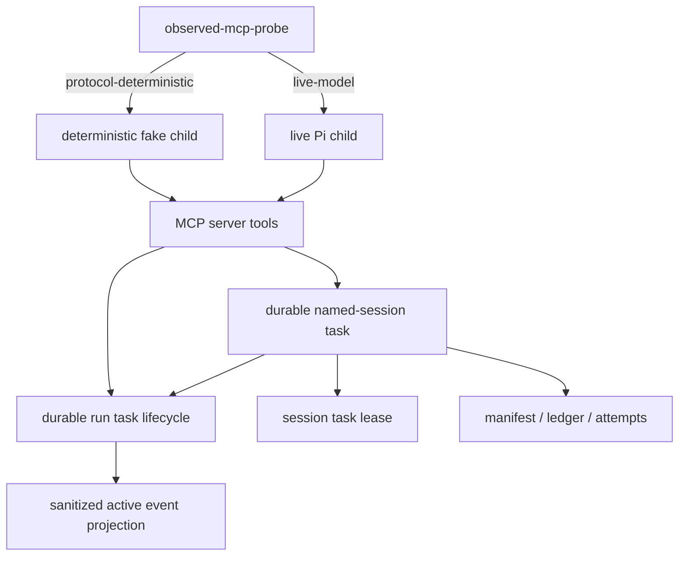

# Current Coherent Revised SAF Implementation Plan

## Summary

Implement the four current-campaign SAFs in a sequence that improves evidence quality first, then active-run observability, then one-shot preflight safety, then durable named-session execution. The plan preserves existing public behavior where possible and adds compatibility wrappers instead of removing current tools.

Implementation status: completed in the current worktree. Verification is tracked by the updated targeted tests in `tests/observed-campaign.test.ts`, `tests/run-subagent.test.ts`, and `tests/session.test.ts`.

---

## Problem Frame

The current observed-use campaign found that core Subagent007 mechanics are healthy, but four upstream incoherences remain:

- active `get_run` views lack safe public evidence before terminal state,
- `run_subagent` still accepts request shapes the server can identify as one-shot-incompatible,
- observed protocol probes can accidentally use live model compliance as protocol evidence,
- named-session execution and lock ownership depend on a synchronous MCP request staying alive.

The coherent revised SAF set narrowed or replaced the original fixes so each one is true at its stated scope. This implementation plan turns that revised set into landable units.

---

## Requirements

- R1. `get_run` must expose bounded, sanitized active evidence for running tasks without leaking raw thinking, raw prompts, control events, or unsanitized child stderr.
- R2. Active-event projection must reuse one sanitizer/normalizer path for active views and final transcript behavior so redaction rules do not fork.
- R3. `run_subagent` must reject known one-shot-incompatible request shapes before child request-file creation.
- R4. One-shot incompatibility rejections must provide actionable `start_run` guidance while preserving terse exact-output and simple inspection one-shot calls.
- R5. Observed protocol probe results must distinguish deterministic protocol evidence from live-model smoke evidence.
- R6. Deterministic protocol scenarios must execute against a deterministic fake child through `SUBAGENT007_PI_CHILD_PATH`, not through live prompt compliance.
- R7. Named session work must have a durable, pollable task identity that survives client request abandonment.
- R8. Session lock ownership must be task- or lease-scoped so abandoned/dead owners are recoverable without blind deletion.
- R9. Existing manifest, ledger, attempt, packet-gating, raw continuity, failure logging, and compatibility tool behavior must remain intact.
- R10. The README and probe usage examples must describe the new evidence classes, active-event fields, one-shot gate, and durable named-session path.

---

## Scope Boundaries

Deferred for later:

- Full event-sourced run history. This plan adds an active projection, not a replayable event store.
- Full scheduler-owned workload routing. This plan rejects known incompatible one-shot shapes, not every slow or ambiguous prompt.
- Historical telemetry migration. Existing failure records and old reports remain historical artifacts.

Outside this plan:

- Changing model-class calibration.
- Removing `run_subagent_session` or `list_allowed_models`.
- Replacing the packet schema or weakening required-packet strictness.

---

## Key Technical Decisions

- KTD1. Deterministic probes come first. Probe determinism is the cheapest way to make every later unit easier to verify and prevents another live-model behavior from being mistaken for protocol evidence.
- KTD2. Active event projection stays bounded and compatibility-oriented. Add fields to `RunTaskView` rather than replacing snapshots with a ledger.
- KTD3. Active event sanitization is a shared transcript primitive. Export a public-event normalizer from `src/transcript.ts` or move it to a small shared module; do not create a second redaction implementation in `src/runTask.ts`.
- KTD4. One-shot gating is a hard incompatibility gate, not a scoring model. Start with explicit predicates that are high-confidence enough to reject before spawn.
- KTD5. Durable named sessions should reuse the run-task lifecycle instead of creating a parallel task manager. The task map, snapshots, cancellation, timeout, and `get_run` machinery are already the closest authority.
- KTD6. Session locks become lease records, not just PID files. A lock should include task identity and refresh timing so recovery can distinguish active work from abandoned local residue.
- KTD7. Keep synchronous session calls as compatibility wrappers. `run_subagent_session` can start a durable session task and wait for terminal state within its request budget, while async callers use the new durable path directly.

---

## High-Level Technical Design

The target shape is one lifecycle authority for ordinary runs and named-session runs. `get_run` can project both terminal results and active evidence. Probe scenarios can separately assert deterministic protocol behavior and live provider behavior.

---

## Implementation Units

### U1. Deterministic Probe Evidence Boundary

- **Goal:** Make observed protocol probes deterministic when they claim protocol coverage.
- **Files:**
  - `scripts/run-observed-mcp-probe.mjs`
  - `scripts/run-observed-campaign.mjs`
  - `tests/observed-campaign.test.ts`
  - `tests/helpers/fakePiChild.ts`
  - `README.md`
- **Plan:**
  - Add a probe mode option such as `--mode protocol-deterministic` and `--mode live-model`.
  - In `protocol-deterministic`, create or locate a deterministic fake child and launch the server environment with `SUBAGENT007_PI_CHILD_PATH`.
  - Keep live provider scenarios in `live-model`; they must not claim deterministic `child-failure`, packet, timeout, or transcript-redaction coverage.
  - Extend `SCENARIO_REGISTRY` entries with `evidence_class` values that reflect the selected mode.
  - Compute covered and uncovered surfaces per evidence class.
  - Update usage text and README examples to stop implying that `all-bundled` is complete live E2E coverage.
- **Existing patterns to follow:**
  - `tests/observed-campaign.test.ts` already launches the probe with `SUBAGENT007_PI_CHILD_PATH`.
  - `tests/helpers/fakePiChild.ts` already has deterministic `FAIL_EXIT`, packet, timeout, and transcript branches.
- **Test scenarios:**
  - `tests/observed-campaign.test.ts`: deterministic `child-failure` always returns a nonzero failure and logs `nonzero_exit`.
  - `tests/observed-campaign.test.ts`: deterministic packet-failure returns structured packet-failure evidence without a live model.
  - `tests/observed-campaign.test.ts`: live-model mode excludes deterministic-only scenarios or labels them as unavailable.
  - `tests/observed-campaign.test.ts`: coverage summary includes evidence class per scenario and per-surface covered/uncovered lists.
- **Verification:**
  - `npm run build`
  - `npm test -- tests/observed-campaign.test.ts`
  - `npm run observed-campaign -- --campaign-id campaign.verify-deterministic -- npm run observed-mcp-probe -- --server ./dist/server.js --cwd "$(pwd)" --mode protocol-deterministic --scenario all-bundled`

### U2. Shared Public Event Sanitizer And Active Projection

- **Goal:** Add bounded active evidence to `get_run` without introducing a second redaction authority.
- **Files:**
  - `src/transcript.ts`
  - `src/runTask.ts`
  - `src/processRunner.ts`
  - `src/types.ts`
  - `tests/run-subagent.test.ts`
  - `tests/timeout-budget.test.ts`
- **Plan:**
  - Extract a public event normalizer from `src/transcript.ts` that can produce typed public events from structured child output lines and public timeout/cancel markers.
  - Add a small type such as `RunPublicEvent` with fields like `kind`, `text`, and `occurred_at`.
  - Add bounded `recent_events` and `last_public_output_excerpt` fields to `RunTaskView`.
  - Extend `runChildProcess` to accept an output-line or public-event callback while preserving current combined-output buffering.
  - In `runTask.ts`, append sanitized public events to active task state and write snapshots when events arrive.
  - Include input-request lifecycle events from existing mailbox views without exposing answers or prompt text.
  - Keep event count and excerpt length configurable or fixed with conservative defaults.
- **Existing patterns to follow:**
  - `preparePublicTranscriptFromProcessOutput` already excludes raw thinking and control events.
  - `writeTaskSnapshot` already atomically writes task views.
  - `waitForActiveHeartbeat` in `tests/run-subagent.test.ts` already polls active snapshots.
- **Test scenarios:**
  - `tests/run-subagent.test.ts`: fake child emits `RAW_THINKING_TRANSCRIPT`; active `recent_events` contains public assistant text but not `SECRET_THINKING_SHOULD_NOT_LEAK`, `thinking_delta`, or raw control fields.
  - `tests/run-subagent.test.ts`: fake child emits warning/error before waiting; `get_run` exposes sanitized warning/error events before terminal state.
  - `tests/run-subagent.test.ts`: timeout and cancellation markers appear as public marker events without exposing raw prompt text.
  - `tests/run-subagent.test.ts`: active event list is bounded after many emitted public events.
  - `tests/run-subagent.test.ts`: terminal snapshots are not overwritten by late heartbeat or event writes.
- **Verification:**
  - `npm run build`
  - `npm test -- tests/run-subagent.test.ts tests/timeout-budget.test.ts`
  - Installed smoke: start a long fake or live run that emits public output and verify `get_run` exposes `recent_events`.

### U3. One-Shot Incompatibility Gate

- **Goal:** Reject known one-shot-incompatible `run_subagent` requests before child spawn.
- **Files:**
  - `src/validate.ts`
  - `src/runTask.ts`
  - `src/runSubagent.ts`
  - `src/failureLog.ts`
  - `src/types.ts`
  - `tests/validation.test.ts`
  - `tests/run-subagent.test.ts`
  - `README.md`
- **Plan:**
  - Add an explicit one-shot compatibility check after standard request resolution and before model-health check or child request creation.
  - Predicate categories:
    - any `skill_name` or legacy `skill` unless an allowlist is introduced,
    - prompt skill invocation syntax already detected by current validation,
    - broad-work markers such as `audit`, `campaign`, `HORC`, `SAF`, `synthesize`, `implementation plan`, `review the repo`, and equivalent high-confidence phrases,
    - prompt length over a conservative default threshold,
    - `tool_profile` plus prompt markers that imply long shell/write work.
  - Return a `ValidationError` that says the request is incompatible with `run_subagent` and should use `start_run` with explicit `timeout_ms` for long or exploratory work.
  - Add failure reason classification, likely `run_subagent_incompatible_workload` or a narrower invalid-request reason.
  - Ensure MCP schema errors and validation errors remain distinct: schema rejects unsupported fields; handler validation rejects incompatible but schema-valid requests.
- **Existing patterns to follow:**
  - `validateAndResolveRequest` already centralizes public input validation.
  - `assertModelClassUsableForOneShot` already proves one-shot fast-fail before spawn.
  - Tests already assert fake child logs are absent for preflight failures.
- **Test scenarios:**
  - `tests/validation.test.ts`: one-shot gate rejects skill-bound requests for `run_subagent` but not `start_run`.
  - `tests/run-subagent.test.ts`: MCP `run_subagent` rejects an obvious HORC/SAF synthesis prompt before fake child log creation.
  - `tests/run-subagent.test.ts`: long prompt over the threshold rejects before child log creation.
  - `tests/run-subagent.test.ts`: terse exact-output prompt still completes.
  - `tests/failure-log.test.ts`: validation failure logs a precise reason without storing prompt text.
- **Verification:**
  - `npm run build`
  - `npm test -- tests/validation.test.ts tests/run-subagent.test.ts tests/failure-log.test.ts`
  - Installed smoke: known broad prompt through `run_subagent` rejects immediately with `start_run` guidance.

### U4. Durable Named-Session Task Lifecycle

- **Goal:** Make named session execution durable, pollable, and lock-safe when clients abandon requests.
- **Files:**
  - `src/server.ts`
  - `src/runTask.ts`
  - `src/session.ts`
  - `src/types.ts`
  - `src/failureLog.ts`
  - `tests/session.test.ts`
  - `tests/run-subagent.test.ts`
  - `README.md`
- **Plan:**
  - Introduce a session task request/result shape that can carry `session_key`, `resume_mode`, `packet_policy`, and the existing common run inputs.
  - Prefer adding a new async tool, for example `start_session_run`, if overloading `start_run` would make the schema ambiguous. Keep `run_subagent_session` as the synchronous compatibility wrapper.
  - Refactor `runSubagentSession` into a lower-level executor that can run under a durable task and return the existing `RunSubagentSessionResult`.
  - Add a session-task state variant in `runTask.ts`, or create a small task adapter that stores session result fields inside compatible task snapshots.
  - Extend `get_run` to return session-task fields when a run id belongs to a named-session task.
  - Add cancellability for active session tasks; cancellation must close input requests and release or expire the session lease safely.
  - Preserve current manifest/ledger/attempt behavior by reusing session promotion and packet-gating logic.
- **Lock and lease design:**
  - Replace or extend `run.lock` with fields including `task_id`, `pid`, `hostname`, `created_at`, and `lease_expires_at`.
  - Active session tasks refresh the lease on heartbeat or a dedicated interval.
  - Lock acquisition may recover a local stale lock only when the owner process is definitely gone or the lease has expired.
  - Release remains best-effort in `finally`; lease expiry covers abandoned requests.
- **Compatibility behavior:**
  - `run_subagent_session` starts a durable session task and waits synchronously until terminal state or request budget.
  - If it cannot wait to terminal due to timeout/request abandonment, the durable task remains inspectable through `get_run` or the new polling path.
  - Existing successful synchronous results should keep their field names and semantics.
- **Existing patterns to follow:**
  - `runSubagentSession` already separates candidate attempt session, packet extraction, manifest promotion, and attempts ledger.
  - `runTask.ts` already handles task snapshots, cancellation, mailbox closure, and restarted-server active snapshots.
  - `session.test.ts` already verifies stale local lock recovery and packet commit/non-commit behavior.
- **Test scenarios:**
  - `tests/session.test.ts`: durable session task creates and resumes a named session with the same manifest/ledger shape as current synchronous calls.
  - `tests/session.test.ts`: invalid required-packet attempt records in `attempts.jsonl` and does not create or mutate `manifest.json`.
  - `tests/run-subagent.test.ts`: MCP async session-start returns a run id immediately and `get_run` exposes `session_key`, `packet_parse_status`, attempt id, and terminal result.
  - `tests/run-subagent.test.ts`: cancellation of an active named-session task releases/closes lease and pending input requests.
  - `tests/session.test.ts`: forced stale lease with dead local owner is recoverable; live unexpired lease rejects as already running.
  - `tests/run-subagent.test.ts`: compatibility `run_subagent_session` still returns the existing synchronous result on quick success.
- **Verification:**
  - `npm run build`
  - `npm test -- tests/session.test.ts tests/run-subagent.test.ts tests/failure-log.test.ts`
  - Installed smoke: start a long named-session run, poll it, cancel it, then verify the session can be reused or reports a clean terminal state.

### U5. Documentation And Report Coherence

- **Goal:** Make public docs and current reports match the implemented behavior.
- **Files:**
  - `README.md`
  - `reports/full-coherent-revised-saf-set-2026-06-11-current.md`
  - `reports/current-saf-adversarial-stress-test-2026-06-11.md`
  - `reports/observed-real-use-trials-2026-06-11-current.md`
- **Plan:**
  - Update README tool-selection guidance for deterministic probe modes, active `get_run` event fields, one-shot incompatibility rejections, and durable named-session tasks.
  - Add examples for async named sessions and compatibility synchronous named sessions.
  - Add a short note that packet-policy strictness is unchanged.
  - Mark current campaign reports as source decision records if implementation changes supersede their "ready for planning" state.
- **Test scenarios:**
  - No runtime test required, but README examples should align with MCP schemas and command names.
  - Run `rg` over README for old claims that conflict with the new tools or fields.
- **Verification:**
  - `npm run build`
  - `npm test`
  - Manual README/schema consistency check against `src/server.ts`.

---

## Acceptance Examples

- AE1. Given a running child emits public assistant output and a raw thinking event, when a caller polls `get_run`, then `recent_events` contains the assistant output and excludes raw thinking.
- AE2. Given a caller sends a broad HORC/SAF synthesis prompt to `run_subagent`, when validation runs, then the call fails before child spawn with `start_run` guidance.
- AE3. Given a deterministic probe run requests `child-failure`, when the probe executes, then the failure comes from fake-child process exit behavior and not from model interpretation of a prompt.
- AE4. Given a named-session run is active and the client request is abandoned, when a caller later inspects the run, then the task is pollable or the lock lease is expired/recoverable by policy.
- AE5. Given a required-packet named-session attempt returns an invalid packet, when the durable session task completes, then the attempt is recorded and the committed manifest is not advanced.

---

## Risks And Mitigations

| Risk | Impact | Mitigation |
| --- | --- | --- |
| Active event projection leaks sensitive content. | High. It would violate the redaction boundary. | Share sanitizer with transcript rendering and add explicit tests for raw thinking/control events. |
| One-shot gate rejects too many legitimate quick calls. | Medium. It could reduce tool usefulness. | Start with high-confidence predicates and keep terse exact-output tests as canaries. |
| Probe mode split duplicates setup logic. | Medium. It could make harness maintenance harder. | Centralize scenario registry and mode-to-environment construction. |
| Durable named-session tasks create a parallel lifecycle. | High. It could fragment cancellation and snapshots. | Reuse `runTask.ts` as the lifecycle authority and keep session code as executor/promotion logic. |
| Lease expiry corrupts active sessions. | High. It could allow concurrent mutation. | Recover only expired leases or definitely dead local owners; keep live unexpired locks strict. |

---

## Dependencies

- U1 depends on the existing fake-child adapter and campaign harness.
- U2 depends on transcript redaction behavior in `src/transcript.ts`.
- U3 depends on current validation and model-health fast-fail patterns.
- U4 depends on run-task snapshot/cancellation semantics and session manifest/ledger invariants.
- U5 depends on final schemas and public tool names chosen in U1-U4.

---

## Execution Order

1. U1. Deterministic Probe Evidence Boundary.
2. U2. Shared Public Event Sanitizer And Active Projection.
3. U3. One-Shot Incompatibility Gate.
4. U4. Durable Named-Session Task Lifecycle.
5. U5. Documentation And Report Coherence.

Rationale: U1 makes later verification trustworthy. U2 and U3 are local, lower-risk runtime improvements. U4 is larger and should use the improved deterministic harness and active event projection. U5 should land after final tool/schema names settle.

---

## Completeness And Cohesion Audit

### Requirement Coverage

| Requirement | Covered By |
| --- | --- |
| R1 | U2 |
| R2 | U2 |
| R3 | U3 |
| R4 | U3, U5 |
| R5 | U1 |
| R6 | U1 |
| R7 | U4 |
| R8 | U4 |
| R9 | U1, U2, U3, U4 |
| R10 | U5 |

### SAF Coverage

| SAF | Covered By | Notes |
| --- | --- | --- |
| R-SAF-1 bounded active event projection | U2 | Includes sanitizer sharing, bounds, active snapshots, and tests. |
| R-SAF-2 one-shot incompatibility gate | U3 | Includes predicates, pre-spawn guarantee, logging, and negative/positive tests. |
| R-SAF-3 deterministic protocol probe boundary | U1 | Includes fake-child mode, live-model split, evidence classes, and coverage summaries. |
| R-SAF-4 durable named-session lifecycle | U4 | Includes durable task identity, polling, cancellation, lock lease, and manifest invariants. |

### Cohesion Checks

- The plan has one lifecycle authority: `src/runTask.ts` remains the durable task/snapshot/cancellation boundary.
- The plan has one redaction authority: active events must reuse transcript public-event normalization.
- The plan has one protocol evidence boundary: deterministic protocol probes use fake child; live model probes are labeled separately.
- The plan keeps compatibility wrappers instead of removing existing tools.
- The plan preserves packet-gated session transaction semantics while changing task/lock ownership.

### Known Deliberate Gaps

- This plan does not implement a full scheduler for workload routing.
- This plan does not implement a full event ledger.
- This plan does not rewrite historical reports or failure logs beyond documentation coherence.
