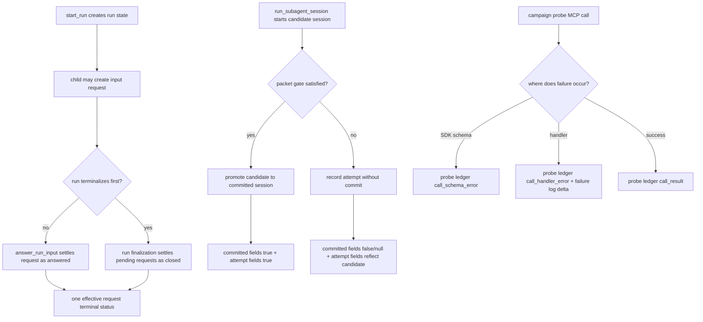

# Full Coherent Revised SAF Implementation Plan

Status note: this plan has been implemented in the current worktree. It remains as traceability for the repaired three-SAF set, not as an open task list.

## Summary

Implement the repaired three-SAF set by giving each boundary a single clear authority: input requests settle through one mailbox primitive, session results expose attempt phase separately from committed phase, and observed campaigns use a protocol-level probe ledger instead of treating server failure logs as complete evidence.

---

## Problem Frame

Observed real-use trials showed that the MCP server's normal execution paths work, but three boundary contracts still leak state-machine ambiguity. Cancelled async runs can still accept late answers, packet-gated session failures can look like missing sessions in public fields, and campaign reports can overclaim because SDK schema errors occur before handler-level failure logging.

The implementation should repair those upstream incoherences without replacing the file-backed state model, changing the committed-session contract, or weakening production MCP schemas.

---

## Requirements

- R1. Input requests must have exactly one effective terminal status across `answered`, `timed_out`, and `closed`.
- R2. A terminal run must not expose input requests as actionable, and `answer_run_input` must reject requests owned by terminal runs.
- R3. Existing mailbox records should remain readable so old `*.answer.json` and `*.timed_out.json` files do not become invisible after the repair.
- R4. `run_subagent_session` results must distinguish attempt session establishment from committed session establishment.
- R5. Existing `subagent_session_id` and `session_established` semantics must remain committed-state semantics for backward compatibility.
- R6. Required-packet failures must be classifiable as packet failures while still exposing whether a candidate Pi session was established.
- R7. Campaign-scoped evidence must include every MCP call attempt made by the campaign probe, including SDK schema rejections that never reach tool handlers.
- R8. Production MCP schemas and production `failures.jsonl` behavior must not be weakened to satisfy campaign observability.
- R9. Each implementation unit must have targeted tests before the final full-suite run.

---

## Key Technical Decisions

- KTD1. Use one terminal settlement primitive for mailbox writes. `answerInputRequest`, input timeout, and run closure should all route through the same mailbox API rather than each writing separate status markers.
- KTD2. Prefer a new terminal marker shape for future mailbox settlements while preserving legacy reads. This avoids continuing the multi-marker write model but keeps old state inspectable.
- KTD3. Keep committed session field names stable. The session repair adds only `attempt_subagent_session_id` and `attempt_session_established`; it does not rename or duplicate committed fields.
- KTD4. Treat campaign evidence as a client/probe concern. The campaign probe records call attempts at the MCP protocol boundary, while server failure logging remains operational telemetry for handler and child failures.
- KTD5. Keep all new result fields optional or additive. Existing callers should not break when the server starts returning richer metadata.

---

## High-Level Technical Design



---

## Implementation Units

### U1. Input Request Settlement Authority

**Goal:** Make mailbox terminal state single-authority and make terminal runs close pending requests.

**Files:**

- `src/inputMailbox.ts`
- `src/runTask.ts`
- `src/runSubagent.ts`
- `src/types.ts`
- `tests/input-mailbox.test.ts`
- `tests/run-subagent.test.ts`

**Design:**

- Add `closed` to the public input request status set.
- Add a future-facing terminal marker record, for example `<request>.terminal.json`, with `status`, `settled_at`, and optional reason fields.
- Keep `requestStatus()` able to read legacy `*.answer.json` and `*.timed_out.json` markers so existing state remains visible.
- Add `settleInputRequest({ mailboxRoot, requestId, outcome, answer? })`.
  - `answered` requires a nonempty answer.
  - `timed_out` and `closed` do not carry answer text.
  - If a request already has any effective terminal status, return or throw deterministically according to the current public behavior: duplicate answer still rejects, late answer after timeout/closed rejects.
- Rework `answerInputRequest()` to call `settleInputRequest(..., "answered")` instead of writing `*.answer.json` directly.
- Rework timeout handling in `waitForInputAnswer()` so timeout uses the same settlement primitive.
- Add `closePendingInputRequestsForRun({ mailboxRoot, runId })`.
- Call `closePendingInputRequestsForRun()` from `cancelRunTask()` after setting cancellation and from the `startRunTask()` finalization path for terminal non-completed states.
- Add a terminal-run guard in `answerRunTaskInput()` so it refuses answers once `state.result`, `state.error`, or `state.cancelRequested` makes the run terminal or terminalizing.

**Test Scenarios:**

- `tests/input-mailbox.test.ts`: a request can be settled once as `answered`; duplicate answer rejects.
- `tests/input-mailbox.test.ts`: unanswered request timeout settles as `timed_out`; late answer rejects.
- `tests/input-mailbox.test.ts`: explicit close settles as `closed`; late answer rejects; `listInputRequests({ status: "closed" })` returns it.
- `tests/input-mailbox.test.ts`: legacy `*.answer.json` and `*.timed_out.json` records are still classified correctly.
- `tests/run-subagent.test.ts`: cancel an input-required run, verify request becomes `closed`, `get_run` does not report actionable `pending`, and `answer_run_input` rejects the closed request.
- `tests/run-subagent.test.ts`: answer/cancel contention produces exactly one effective terminal status.

**Acceptance:**

- No code path writes a new answer, timeout, or close status outside the mailbox settlement primitive.
- Cancelled runs no longer contain actionable pending input requests.
- Old mailbox files remain readable.

### U2. Attempt-Phase Session Metadata

**Goal:** Expose candidate Pi session establishment separately from committed session promotion.

**Files:**

- `src/types.ts`
- `src/session.ts`
- `tests/session.test.ts`
- `tests/failure-log.test.ts`
- `README.md`

**Design:**

- Add optional attempt-phase fields to `SessionRunRecord`:
  - `attempt_subagent_session_id: string | null`
  - `attempt_session_established: boolean`
- Add the same fields to `RunSubagentSessionResult`.
- Preserve `subagent_session_id` and `session_established` as committed-state fields.
- Populate attempt fields from `attemptSubagentSessionId` and `attemptSessionEstablished`.
- For successful creates/resumes, attempt and committed fields should both indicate a session, though the path may differ before promotion; the public result should report the final promoted committed path in `subagent_session_id`.
- For packet-required failures, attempt fields should show the candidate session when Pi reported one, while committed fields remain null or previous-manifest committed state.
- For missing-session failures, both attempt and committed fields should make the absence clear.
- Update README session result notes so packet failures do not look like Pi session establishment failures.

**Test Scenarios:**

- `tests/session.test.ts`: required packet success returns `attempt_session_established: true` and `session_established: true`.
- `tests/session.test.ts`: required non-ready packet failure returns `attempt_session_established: true`, `attempt_subagent_session_id` pointing under `attempt-pi-sessions`, `session_established: false`, and `subagent_session_id: null` for a new session.
- `tests/session.test.ts`: failed resume with non-ready packet preserves committed `subagent_session_id` for the existing manifest while attempt fields point to the attempt session.
- `tests/session.test.ts`: missing-session failure returns `attempt_session_established: false`.
- `tests/failure-log.test.ts`: non-ready required packet remains `packet_failed/packet_required_invalid`; missing session remains `missing_session_id`.

**Acceptance:**

- Public fields no longer conflate candidate session existence with committed session promotion.
- Existing committed-session clients keep working.
- Packet gate failures are inspectable without reading internal attempt directories.

### U3. Campaign MCP Probe Ledger

**Goal:** Make campaign evidence complete at the MCP call-attempt boundary.

**Files:**

- `scripts/run-observed-campaign.mjs`
- new `scripts/run-observed-mcp-probe.mjs` or equivalent probe helper
- `tests/observed-campaign.test.ts`
- `tests/failure-log.test.ts`
- `README.md`
- future campaign reports under `reports/`

**Design:**

- Keep `scripts/run-observed-campaign.mjs` as the environment/state-root launcher.
- Add a campaign ledger path to the harness environment, for example `SUBAGENT007_CAMPAIGN_LEDGER_PATH`, defaulting to `<state_root>/campaign-ledger.jsonl`.
- Include `campaign_ledger_path` in the harness JSON summary.
- Add a probe runner that starts or connects to the campaign-scoped MCP server through `StdioClientTransport` and records one ledger event for every call attempt:
  - `call_started`
  - `call_result`
  - `call_schema_error`
  - `call_handler_error`
  - `failure_log_delta`
- Redact or classify arguments rather than writing raw prompts into the campaign ledger.
- Record both successful calls and failed calls so reports can distinguish attempted-successful from unattempted.
- Keep server-side failure logging unchanged except for reading the existing campaign ID.
- Update README to state that only MCP calls made through the campaign probe may claim complete call-attempt coverage.

**Test Scenarios:**

- `tests/observed-campaign.test.ts`: harness summary includes `campaign_ledger_path`, and the path is inside `state_root`.
- `tests/observed-campaign.test.ts`: probe records an SDK schema rejection as `call_schema_error` even though server `failures.jsonl` does not change.
- `tests/observed-campaign.test.ts`: probe records a handler-level validation failure and a corresponding `failure_log_delta`.
- `tests/observed-campaign.test.ts`: probe records a child failure or packet failure and the failure-log delta.
- `tests/observed-campaign.test.ts`: probe records a success as `call_result`.
- Existing harness tests for isolated state paths, invalid campaign IDs, child exit code preservation, and archive behavior remain green.

**Acceptance:**

- A campaign report can cite one ledger that proves every MCP call attempt made by the campaign.
- Production strict schemas remain strict.
- Production `failures.jsonl` is not represented as complete campaign evidence.

---

## Scope Boundaries

In scope:

- additive result fields,
- mailbox terminal-state repair,
- campaign probe and campaign ledger,
- README updates for the changed public semantics,
- targeted tests plus full-suite verification.

Out of scope:

- replacing the mailbox with a database or event store,
- redesigning `run_subagent_session` into a nested transaction result,
- weakening MCP schemas to force all validation into handlers,
- claiming production telemetry completeness,
- retroactively rewriting existing failure logs or campaign reports.

---

## Acceptance Examples

- AE1. Given a run is waiting on input, when `cancel_run` is called, then its pending input request becomes `closed` and later `answer_run_input` fails.
- AE2. Given an old mailbox request has only `*.answer.json`, when listed after the change, then it still appears as `answered`.
- AE3. Given `run_subagent_session` fails because a required packet is non-ready, when the child created a candidate session, then attempt fields are true while committed fields remain false/null for a new session.
- AE4. Given a campaign probe sends malformed arguments rejected by SDK schema validation, when the call returns an error, then the campaign ledger records the attempt even though server failure logging is not invoked.

---

## Verification Plan

Targeted verification during implementation:

```bash
node scripts/run-tests-with-ledger-guard.mjs tests/input-mailbox.test.ts
node scripts/run-tests-with-ledger-guard.mjs tests/run-subagent.test.ts
node scripts/run-tests-with-ledger-guard.mjs tests/session.test.ts
node scripts/run-tests-with-ledger-guard.mjs tests/failure-log.test.ts
node scripts/run-tests-with-ledger-guard.mjs tests/observed-campaign.test.ts
```

Final verification:

```bash
npm run typecheck
npm test
npm run observed-campaign -- --campaign-id plan.verify.20260610 -- node -e "process.exit(0)"
```

Manual smoke checks after automated tests:

- Start an input-required async run, cancel it, and verify the request is closed.
- Run a required-packet non-ready session and verify attempt fields are present.
- Run the campaign probe against one success and one schema rejection, then inspect the campaign ledger.

---

## Cohesion Checks

- Every requirement maps to one implementation unit: R1-R3 to U1, R4-R6 to U2, and R7-R8 to U3; R9 applies to all units.
- U1 must land before any live re-test of cancellation semantics because it changes the meaning of actionable input.
- U2 is independent of U1 because session attempts use separate state directories and do not depend on mailbox settlement.
- U3 should land after U1 and U2 so its probe can cover the repaired semantics.
- No unit requires a new branch, database, daemon, or external service.
- All public contract changes are additive except the intended rejection of late answers after terminal runs.
- The plan preserves the three coherence rules from the revised SAF set: one terminal transition per lifecycle object, phase-named result fields, and evidence claims scoped to the observer.
