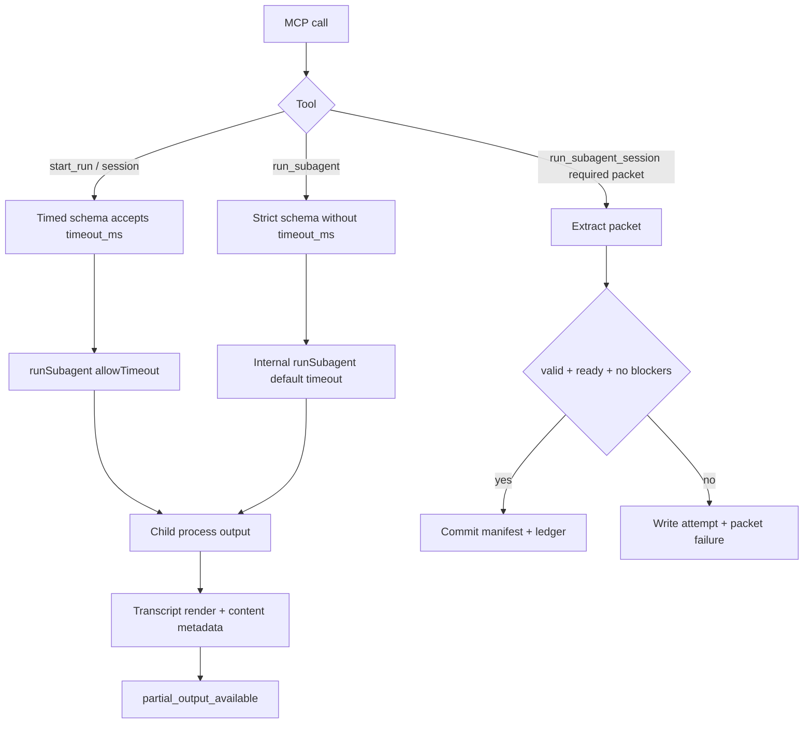

# Revised SAF Implementation Plan

Status: executed plan. This document remains as implementation traceability for the current change set, not as an unstarted plan.

## Summary

Implement the three revised SAFs for `subagent007-pi`: required packet success must mean claimed ready handoff, `run_subagent` must neither expose nor accept caller `timeout_ms`, and `partial_output_available` must mean public child-generated content exists. The work is small enough for one cohesive change set, but each SAF has distinct tests and should be implemented in the order below.

---

## Problem Frame

The observed trials found that core child execution is healthy, but three public contract boundaries are misleading: required packet success ignores packet verdict, the `run_subagent` schema exposes a forbidden field, and timeout partial-output metadata can be true without child-generated content. The revised SAF set in `reports/revised-saf-set-2026-06-10.md` narrows each fix to an exact invariant.

---

## Requirements

- R1. `run_subagent_session` with `packet_policy: required` commits only when the packet is parse-valid, has `verdict: "ready"`, and has an empty `blockers` array.
- R2. Non-ready required packets write attempts, do not advance the committed session manifest or ledger, and are classified as packet failures.
- R3. `run_subagent` public MCP schema does not include `timeout_ms`.
- R4. A `run_subagent` MCP call containing `timeout_ms` returns `isError: true` instead of silently ignoring the field.
- R5. `start_run` and `run_subagent_session` continue to accept and honor `timeout_ms`.
- R6. `partial_output_available` is true only when timeout output contains public child-generated assistant text, `subagent007.warning`, or `subagent007.error`.
- R7. Transcript redaction behavior remains intact; private thinking/tool payloads must not become public output or metadata drivers.
- R8. README behavior descriptions match the implemented contracts.

---

## Key Technical Decisions

- KTD1. **Gate required packets on claimed readiness, not independent truth:** The server should align `success` with the packet's own `verdict` and `blockers`, but it should not attempt to prove the packet claims are true.
- KTD2. **Use a strict public schema for `run_subagent`:** A strict Zod object without `timeout_ms` is the smallest way to hide the field from `listTools()` and reject calls that still supply it.
- KTD3. **Return transcript content-kind metadata near transcript rendering:** `src/transcript.ts` already classifies public event lines, so it is the right layer to decide whether public child-generated content exists.
- KTD4. **Preserve existing artifact formats and result field names:** Keep `partial_output_available` and output Markdown shape stable; change the field's computation and documentation instead of adding a parallel public field.

---

## High-Level Technical Design

---

## Implementation Units

### U1. Public Schema Contract For `run_subagent`

- **Goal:** Make `run_subagent` omit `timeout_ms` from its public schema while still rejecting calls that include it.
- **Files:** `src/server.ts`, `tests/failure-log.test.ts`, `tests/run-subagent.test.ts`
- **Pattern references:** Existing MCP client tests in `tests/failure-log.test.ts`; tool registration in `src/server.ts`.
- **Implementation notes:** Split the shared input shape into a timeout-free base shape and timed shape. Register `run_subagent` with a strict Zod object that omits `timeout_ms`. Keep `start_run` and `run_subagent_session` schemas timed. Keep the `runSubagent` runtime guard in `src/runSubagent.ts` unchanged as defense in depth.
- **Test scenarios:**
  - `listTools()` shows no `timeout_ms` property for `run_subagent`.
  - `run_subagent` with `timeout_ms` returns `isError: true` and does not write failure-log records.
  - `run_subagent` without `timeout_ms` still completes through the fake child.
  - `start_run` with `timeout_ms` still starts and reports requested timeout metadata.
  - `run_subagent_session` with `timeout_ms` still accepts the field.

### U2. Required Packet Readiness Gate

- **Goal:** Align required packet session success with the packet's claimed readiness.
- **Files:** `src/session.ts`, `src/failureLog.ts`, `tests/session.test.ts`, `tests/failure-log.test.ts`, `tests/helpers/fakePiChild.ts`
- **Pattern references:** `writePacket` and `packetSatisfied` in `src/session.ts`; packet extraction in `src/packet.ts`; existing required-packet tests in `tests/session.test.ts`.
- **Implementation notes:** Change `packetSatisfied` to inspect both parse status and claimed packet. For `required`, only `valid + ready + empty blockers` satisfies the contract. Add fake child prompt branches for non-ready packets: `PACKET_INCONCLUSIVE`, `PACKET_NEEDS_REPAIR`, `PACKET_BLOCKED`, and `PACKET_READY_WITH_BLOCKER`. Preserve best-effort semantics unless the revised tests reveal a clear contradiction.
- **Test scenarios:**
  - Required `PACKET_VALID` succeeds and commits as it does today.
  - Required `PACKET_INCONCLUSIVE` returns `success: false`, `created_or_resumed: "not_created"`, and writes one attempt.
  - Required `PACKET_NEEDS_REPAIR` fails and writes one attempt.
  - Required `PACKET_BLOCKED` fails and writes one attempt.
  - Required `PACKET_READY_WITH_BLOCKER` fails despite `verdict: "ready"`.
  - A failed required packet on an existing session leaves manifest `run_count` and `last_output_path` unchanged.
  - Failure logging classifies non-ready required packets as packet failures.

### U3. Transcript Content Metadata And Partial Output Semantics

- **Goal:** Compute `partial_output_available` from public child-generated content, not output bytes.
- **Files:** `src/transcript.ts`, `src/output.ts`, `src/runSubagent.ts`, `tests/timeout-budget.test.ts`, `tests/run-subagent.test.ts`, `tests/helpers/fakePiChild.ts`
- **Pattern references:** `publicTranscriptFromProcessOutput` in `src/transcript.ts`; `writeRunOutput` in `src/output.ts`; timeout metadata assertions in `tests/timeout-budget.test.ts`.
- **Implementation notes:** Add a structured transcript preparation function that returns rendered text plus metadata such as `hasAssistantText`, `hasSubagentWarning`, and `hasSubagentError`. Have `writeRunOutput` return that metadata for transcript-mode outputs. In `runSubagent`, set `partial_output_available` on timeout when either a nonempty final message was captured or one of the transcript child-content flags is true. Keep ANSI/control stripping and truncation behavior.
- **Test scenarios:**
  - Timeout output with unstructured raw child text but no public assistant/warning/error returns `partial_output_available: false` while still writing the transcript file.
  - Timeout output with a public assistant `message_end` event returns `partial_output_available: true`.
  - Timeout output with `subagent007.warning` returns `partial_output_available: true`.
  - Timeout output with `subagent007.error` returns `partial_output_available: true`.
  - Timeout after a nonempty final-message file is written returns `partial_output_available: true`.
  - Cancellation marker alone does not set `partial_output_available`.
  - `RAW_THINKING_TRANSCRIPT` still redacts thinking payloads.

### U4. Documentation Alignment

- **Goal:** Make README match the new public contracts.
- **Files:** `README.md`
- **Pattern references:** Current tool usage section and timeout/packet-policy sections in `README.md`.
- **Implementation notes:** Update `packet_policy: required` wording to say a ready packet with no blockers is required. Confirm `run_subagent` has no caller `timeout_ms` input. Define `partial_output_available` as public child-generated content availability, not arbitrary transcript bytes.
- **Test scenarios:** Documentation review only; no executable test. Check README examples do not imply parse-only required packet success or caller timeout support for `run_subagent`.

---

## Scope Boundaries

- Do not implement config alias migration or config doctor behavior in this change set.
- Do not add independent truth verification for contract packets.
- Do not rename public result fields unless implementation reveals a compatibility blocker.
- Do not broaden strict schema changes beyond what is needed for `run_subagent` unless the same helper can be applied without changing behavior.

---

## Risks And Dependencies

- **Strict schema compatibility:** Making `run_subagent` strict may reject unrelated unknown keys that were previously stripped. That is acceptable for a tool contract, but tests should verify the intended `timeout_ms` rejection explicitly.
- **Failure reason specificity:** Reusing `packet_required_invalid` is lower churn than adding a new reason code, but less precise for non-ready packets. Add a new reason only if tests or observability needs justify the schema expansion.
- **Partial output semantics:** Existing timeout tests currently expect `partial_output_available: true` for raw timeout bytes. Update that expectation only where the raw bytes are not public child-generated assistant/warning/error content.
- **Fake child fidelity:** New fake child branches must emit outputs in the same shape real `piChild` emits, especially structured `message_end`, warning, error, and final-message-before-timeout cases.

---

## Acceptance Examples

- AE1. Given a required session packet with `verdict: "inconclusive"` and blockers, when the run finishes, then `success` is false, the attempt is recorded, and the manifest does not advance.
- AE2. Given a generated MCP schema for `run_subagent`, when a client lists tools, then `timeout_ms` is absent from `run_subagent` properties.
- AE3. Given a caller still sends `timeout_ms` to `run_subagent`, when the call is validated, then the call returns `isError: true`.
- AE4. Given a timeout transcript containing only the user prompt and timeout marker, when metadata is returned, then `partial_output_available` is false.
- AE5. Given a timeout transcript containing public assistant text before the timeout marker, when metadata is returned, then `partial_output_available` is true.

---

## Verification Plan

Run local verification in this order:

1. `npm run typecheck`
2. `npm test`
3. `npm run models:reconcile`

Then repeat live probes:

1. MCP `listTools()` schema inspection for `run_subagent`.
2. MCP `run_subagent` call with `timeout_ms` and a valid prompt.
3. MCP `run_subagent_session` with `packet_policy: required` and a non-ready packet-producing prompt.
4. MCP timeout run that produces no public assistant/warning/error content.

---

## Cohesion Check

- R1 and R2 are fully covered by U2.
- R3 and R4 are fully covered by U1.
- R5 is covered by U1 regression tests for timed tools.
- R6 and R7 are fully covered by U3.
- R8 is covered by U4.
- The units are sequenced so public schema behavior is stabilized first, session commit semantics second, output metadata third, and documentation last.
- Every runtime behavior change has at least one direct test scenario and one named file touchpoint.
